# Execution Platform: Workflow Orchestration & Backend Services

**Document Type:** Execution Architecture
**Date:** October 28, 2025
**Status:** Target State Architecture

---

## Overview

The execution platform orchestrates durable workflows for OSINT investigations using Temporal as the core workflow engine. The architecture separates execution orchestration (Temporal) from data transformations (Dagster), with backend services written in Go for high-performance request processing.

**Key Components:**
- **Temporal:** Durable workflow engine (stateful execution, retry logic, step-level recovery)
- **User API:** Go service for manual pipeline processing
- **YAML Processor:** Go service converting ODP YAML DSL to Temporal/Dagster workflows
- **Agent Orchestrator:** Python + LangGraph for AI-driven pipeline generation

---

## Temporal Workflow Engine

### Architecture



```mermaid
%%{init: {'theme':'neutral'}}%%
graph TB
    subgraph "Client Layer"
        UserAPI[📝 User API<br/>Go]
        AgentOrch[🤖 Agent Orchestrator<br/>Python]
    end

    subgraph "YAML Processing"
        YAMLProcessor[🔄 YAML Processor<br/>Go Service]
    end

    subgraph "Temporal Cluster"
        Frontend[🌐 Frontend Service<br/>gRPC API]
        History[📜 History Service<br/>Event store]
        Matching[🔍 Matching Service<br/>Task routing]
        Workers[⚙️ Worker Nodes<br/>Workflow execution]
    end

    subgraph "Persistence"
        PostgreSQL[(🗄️ PostgreSQL<br/>Patroni HA)]
    end

    subgraph "External Systems"
        Crawlers[🕷️ Crawlers<br/>OpenFaaS]
        Models[🧠 ML Models<br/>BentoML]
        DataPipeline[🗄️ Data Platform<br/>Dagster]
    end

    UserAPI --> YAMLProcessor
    AgentOrch --> YAMLProcessor
    YAMLProcessor --> Frontend

    Frontend --> History
    Frontend --> Matching
    History --> PostgreSQL
    Matching --> Workers

    Workers --> Crawlers
    Workers --> Models
    Workers --> DataPipeline

    %% Client Layer
    style UserAPI fill:#C8E6C9,stroke:#388E3C,stroke-width:2px,color:#000
    style AgentOrch fill:#E1BEE7,stroke:#7B1FA2,stroke-width:2px,color:#000

    %% YAML Processing
    style YAMLProcessor fill:#FFF59D,stroke:#F57F17,stroke-width:2px,color:#000

    %% Temporal Cluster components
    style Frontend fill:#FFE0B2,stroke:#F57C00,stroke-width:2px,color:#000
    style History fill:#FFE0B2,stroke:#F57C00,stroke-width:2px,color:#000
    style Matching fill:#FFE0B2,stroke:#F57C00,stroke-width:2px,color:#000
    style Workers fill:#FFE0B2,stroke:#F57C00,stroke-width:2px,color:#000

    %% Persistence
    style PostgreSQL fill:#E0E0E0,stroke:#616161,stroke-width:2px,color:#000

    %% External Systems
    style Crawlers fill:#E1BEE7,stroke:#7B1FA2,stroke-width:2px,color:#000
    style Models fill:#E1BEE7,stroke:#7B1FA2,stroke-width:2px,color:#000
    style DataPipeline fill:#E1BEE7,stroke:#7B1FA2,stroke-width:2px,color:#000
```

### Deployment Configuration

**Kubernetes Deployment:**
- 3 replicas (HA deployment, active-active)
- PostgreSQL backend (connection via Kubernetes service discovery)
- Resource allocation: 2-4 CPU, 4-8 Gi memory per pod
- Ports: gRPC (7233), Membership (7234), History (7235), UI (8080)
- Image: temporalio/auto-setup:1.24.2

### Workflow Execution Model

**Durable Execution:**
- Workflows survive infrastructure failures (automatic state recovery)
- State persisted in PostgreSQL (event sourcing pattern)
- Replay mechanism reconstructs workflow state from event log
- Zero data loss (ACID guarantees via PostgreSQL)

**Multi-Language SDKs:**
- **Python:** ML workflows, data processing (agent orchestrator)
- **Go:** High-performance services, API logic (user API, YAML processor)
- **TypeScript:** Frontend-triggered workflows (admin operations)

**Workflow Pattern:**
- Workflow receives YAML specification as input, iterates through steps sequentially
- Each step type (crawler, ml_model, data_transform) maps to activity execution
- Activities have timeout policies (5-30 minutes) and retry policies (3 attempts max)
- State automatically persisted after each activity (workflow resumes from last completed step on failure)
- Validation step checks results quality, triggers re-planning if needed (human-in-the-loop)

---

## YAML Workflow Specification

### ODP YAML DSL Contract

**Purpose:** Declarative workflow definition bridging agent orchestrator and execution platform

**Authoritative Specification:** This document contains the canonical ODP YAML DSL specification. Other documents reference this section for YAML details.

**Evolution Note:** This specification consolidates and refines the YAML DSL contract. All 15 step types, execution modes, and modern syntax patterns (including `on_success.routes`) are documented here for the target architecture.

### Supported Step Types & Execution Modes

| Step Type      | Orchestrator | Execution Modes         | Default Mode | Configured Via     |
|----------------|--------------|-------------------------|--------------|--------------------|
| crawler        | Temporal     | api OR direct           | api          | execution_mode     |
| wait_for_asset | Temporal     | polling                 | polling      | (implicit)         |
| ml_model       | Temporal     | api OR direct           | api          | execution_mode     |
| ml_serving     | Temporal     | k8s                     | k8s          | (implicit)         |
| llm_flow       | Temporal     | direct OR api           | direct       | execution_mode     |
| llm_agent      | Temporal     | direct                  | direct       | (implicit)         |
| function       | Temporal     | direct                  | direct       | (implicit)         |
| loop           | Temporal     | workflow_logic          | n/a          | (control flow)     |
| validation     | Temporal     | direct                  | direct       | (implicit)         |
| output         | Temporal     | direct                  | direct       | (implicit)         |
| custom_code    | Temporal     | direct                  | direct       | (implicit)         |
| parallel_group | Temporal     | workflow_logic          | n/a          | (control flow)     |
| conditional    | Temporal     | workflow_logic          | n/a          | (control flow)     |
| data_transform | Dagster      | event_driven            | automatic    | (bronze.* outputs) |
| ml_training    | Dagster      | orchestrator_delegation | delegation   | (implicit)         |

**Execution Modes Explained:**
- **api**: Call external service via REST API (default for crawlers, ml_model when hosted)
- **direct**: In-process execution within Temporal worker (Python code, LLM agents, validation logic)
- **k8s**: Deploy as Kubernetes service (BentoML model serving)
- **polling**: Wait for asset availability in Delta Lake (data dependencies)
- **workflow_logic**: Control flow construct (loops, conditionals, parallel groups)
- **event_driven**: Triggered by data events in Delta Lake (Dagster sensors)
- **orchestrator_delegation**: Delegated to Dagster for execution (ML training jobs)

**Structure:**
```yaml
# ODP YAML DSL for Investigation Pipeline
version: "1.0"
pipeline_id: "social-media-investigation-v2"
name: "Social Media Risk Assessment"
workspace_id: "workspace-abc123"
project_id: "project-xyz789"

# Execution configuration
execution:
  mode: "brave"  # or "safe" (requires user approval before execution)
  timeout_minutes: 120
  estimated_cost_units: 25  # Cost estimation for Safe mode approval
  estimated_duration_minutes: 15  # Time estimation for Safe mode approval

# Replay configuration (optional - for historical workflow replay)
replay:
  enabled: false
  original_execution_id: "exec-12345"  # Reference to original execution
  replay_from_step: "validate_results"  # Resume from specific step

# Data collection steps
steps:
  - id: "collect_twitter"
    type: "crawler"
    method: "crawler_twitter_profile"
    retry_policy:  # Per-step retry policy (overrides global)
      max_attempts: 3
      backoff: exponential
      max_backoff_seconds: 60
    inputs:
      username:
        from: "{{input.target_username}}"  # Explicit input binding
    check:  # Conditional routing based on results
      not_exists: profile.profile_picture
        run: collect_twitter2  # Fallback step if profile picture missing
      boolean: profile.recent_posts > 0
        run: analyze_sentiment  # Conditional execution based on data availability
    outputs:
      profile: "twitter_profile_data"
    on_error:  # Error handling
      fallback_step: "collect_twitter2"
      continue_on_failure: false
    resources:
      cpu: "500m"
      memory: "1Gi"

  - id: "collect_twitter2"
    type: "crawler"
    method: "crawler_twitter_profile_alternative"
    is_child: true  # Child tasks skipped on start, activated by check conditions
    retry_policy:
      max_attempts: 2
    inputs:
      username:
        from: "{{input.target_username}}"
    outputs:
      profile: "twitter_profile_data"

  # Loop construct for iterating over multiple sources
  - id: "collect_multiple_sources"
    type: "loop"
    iterate_over: "{{input.sources}}"  # Array of source configurations
    loop_variable: "source"
    max_parallel: 5  # Execute up to 5 iterations in parallel
    steps:
      - id: "crawl_source"
        type: "crawler"
        method: "crawler_{{source.type}}"  # Dynamic method selection
        inputs:
          target:
            from: "{{source.target_identifier}}"
        outputs:
          data: "source_data_{{source.type}}"

  - id: "collect_facebook"
    type: "crawler"
    method: "crawler_facebook_profile"
    inputs:
      user_id:
        from: "{{input.target_fb_id}}"
    depends_on: ["collect_twitter"]  # Sequential dependency
    outputs:
      profile: "facebook_profile_data"

  # Data transformation step (Dagster integration)
  - id: "transform_raw_data"
    type: "data_transform"
    asset: "silver_social_profiles"  # Dagster asset reference
    inputs:
      bronze_data:
        from: "{{collect_twitter.profile}}"
    outputs:
      transformed_data: "silver_profile_data"
    depends_on: ["collect_twitter", "collect_facebook"]

  - id: "recognize_faces"
    type: "ml_model"
    model: "face_recognition_v3"
    inputs:
      images:
        or:  # Fallback input selection (try first, then second)
          - "{{collect_twitter.profile.profile_picture}}"
          - "{{collect_twitter2.profile.profile_picture}}"
          - "{{collect_facebook.profile.profile_picture}}"
    outputs:
      face_embedding: "face_vector"
    resources:
      gpu: 1
      memory: "8Gi"

  - id: "analyze_sentiment"
    type: "ml_model"
    model: "sentiment_analysis_v1"
    inputs:
      texts:
        from: "{{collect_twitter.profile.recent_posts}}"
    outputs:
      sentiment_scores: "sentiment_results"

  - id: "enrich_breach_data"
    type: "function"
    method: "breach_db_lookup"
    inputs:
      email:
        from: "{{collect_twitter.profile.email}}"
    outputs:
      breaches: "breach_records"

  # Wait for Dagster data transformation completion
  - id: "wait_for_silver"
    type: "wait_for_asset"
    assets:
      - "silver.twitter_profiles"
      - "silver.source_twitter"
    timeout_minutes: 10
    poll_interval_seconds: 5
    depends_on: ["transform_raw_data"]

  # LLM Flow for sentiment analysis (direct execution)
  - id: "analyze_sentiment_llm"
    type: "llm_flow"
    flow: "sentiment_analysis_v1"
    execution_mode: "direct"
    inputs:
      texts:
        from: "{{collect_twitter.profile.recent_posts}}"
    outputs:
      sentiment_scores: "sentiment_results"

  # LLM Agent for behavioral pattern analysis (LangGraph)
  - id: "analyze_behavioral_patterns"
    type: "llm_agent"
    agent_type: "langgraph"
    agent_config:
      graph_definition: "behavioral_analysis_v2"
      nodes:
        - id: "gather_context"
          type: "llm"
          model: "sonnet-4.5"
        - id: "risk_assessment"
          type: "llm"
          model: "sonnet-4.5"
      max_iterations: 5
    inputs:
      profile_data:
        from: "{{collect_twitter.profile}}"
      sentiment_data:
        from: "{{analyze_sentiment_llm.sentiment_scores}}"
    outputs:
      behavioral_analysis: "behavioral_patterns"
      risk_score: "risk_score"

  # Custom Python code execution
  - id: "custom_analysis"
    type: "custom_code"
    runtime: "python3.12"
    code:
      source: "inline"
      content: |
        def execute(inputs):
            profile = inputs['profile_data']
            scores = inputs['sentiment_data'].get('scores', [0])
            avg_sentiment = sum(scores) / max(len(scores), 1)

            anomalies = []
            if profile.get('followers_count', 0) > 100000 and profile.get('following_count', 0) < 10:
                anomalies.append('suspicious_follower_ratio')
            if profile.get('post_frequency', 0) > 50:
                anomalies.append('high_posting_frequency')

            return {
                'custom_risk_score': 1.0 - avg_sentiment if avg_sentiment < 0.5 else 0.3,
                'anomalies': anomalies
            }
    inputs:
      profile_data:
        from: "{{collect_twitter.profile}}"
      sentiment_data:
        from: "{{analyze_sentiment_llm.sentiment_scores}}"
    outputs:
      custom_results: "custom_analysis_output"

  # ML Training via Dagster (orchestrator delegation)
  - id: "train_custom_model"
    type: "ml_training"
    training:
      model_type: "llm"
      model: "qwen3-1.7b"
      method: "sft + lora"
      training_data:
        source: "{{wait_for_silver.assets.silver.twitter_profiles}}"
      experiment_name: "custom_models"
    outputs:
      model_version: "model_version"
    depends_on: ["wait_for_silver"]

  # ML Model Serving (BentoML on K8s)
  - id: "deploy_model"
    type: "ml_serving"
    model_uri: "models:/custom_models/{{train_custom_model.model_version}}"
    model_version: "{{train_custom_model.model_version}}"
    service_name: "custom_service"
    outputs:
      service_url: "service_endpoint"
    depends_on: ["train_custom_model"]

  # Conditional branching based on risk score
  - id: "conditional_investigation"
    type: "conditional"
    condition:
      expression: "{{analyze_behavioral_patterns.risk_score}} > 0.75"
    branches:
      if_true:
        steps:
          - id: "deep_dive"
            type: "crawler"
            method: "crawler_deep_web"
            inputs:
              target:
                from: "{{input.target_username}}"
            outputs:
              deep_results: "bronze.deep_web"
      if_false:
        steps:
          - id: "standard_report"
            type: "function"
            method: "generate_report"
            inputs:
              profile:
                from: "{{collect_twitter.profile}}"
              risk_score:
                from: "{{analyze_behavioral_patterns.risk_score}}"
            outputs:
              report: "standard_report_result"

  # Parallel execution group (modern on_success.routes syntax)
  - id: "parallel_network_analysis"
    type: "parallel_group"
    parallel_config:
      max_parallel: 3
    steps:
      - id: "analyze_followers"
        type: "crawler"
        method: "crawler_twitter_followers"
        inputs:
          username:
            from: "{{input.target_username}}"
        outputs:
          followers: "bronze.twitter_followers"
      - id: "graph_analysis"
        type: "ml_model"
        model: "graph_analyzer_v1"
        execution_mode: "direct"
        inputs:
          node_data:
            from: "{{collect_twitter.profile}}"
        outputs:
          graph_metrics: "network_metrics"
    on_success:
      routes:
        - match:
            expression: "{{collect_twitter.profile.followers_count}} > 10000"
          steps:
            - id: "deep_network_analysis"
              type: "ml_model"
              model: "advanced_graph_analyzer_v2"
              inputs:
                followers:
                  from: "{{analyze_followers.followers}}"
                metrics:
                  from: "{{graph_analysis.graph_metrics}}"
              outputs:
                advanced_metrics: "advanced_network_analysis"

  # Validation step (flexible - can be included or omitted)
  - id: "validate_results"
    type: "validation"
    checks:
      relevance:
        enabled: true
        threshold: 0.8  # Field-content matching score
      completeness:
        enabled: true
        threshold: 0.7  # % of required fields populated
    depends_on: ["enrich_breach_data"]

  # Output generation step (flexible - can be included or omitted)
  - id: "generate_output"
    type: "output"
    format: "pdf_report"  # or "graph_visualization", "csv_dataset"
    template: "risk_assessment_v1"
    delivery:
      method: "webhook"
      url: "https://client-system.example.com/webhooks/results"
    depends_on: ["validate_results"]
```

**Key Features:**

1. **15 Step Types:** Complete coverage (crawler, wait_for_asset, ml_model, ml_serving, llm_flow, llm_agent, function, loop, validation, output, custom_code, parallel_group, conditional, data_transform, ml_training)
2. **7 Execution Modes:** api, direct, k8s, polling, workflow_logic, event_driven, orchestrator_delegation
3. **Per-Step Retry Policies:** Each step can define its own retry behavior
4. **Conditional Routing:** Both legacy `check:` blocks and modern `on_success.routes` syntax for dynamic workflow branching
5. **Parallel Execution:** `type: parallel_group` with `max_parallel` configuration
6. **Child Tasks:** `is_child: true` for steps activated only by conditions
7. **Input Fallbacks:** `or:` arrays provide alternative input sources
8. **Explicit Input Binding:** `from:` syntax for clear data dependencies
9. **Loop Construct:** `type: loop` for iterating over collections with parallel execution support
10. **Error Handling:** `on_error:` blocks define failure recovery
11. **Cost/Time Estimation:** Support for Safe mode approval workflows
12. **Historical Replay:** `replay:` configuration for re-running pipelines
13. **Data Transform Integration:** `type: data_transform` for Dagster jobs
14. **Resource Requirements:** CPU/GPU/memory allocation per step
15. **Custom Code Execution:** Inline Python code with `type: custom_code`
16. **ML Training & Serving:** Orchestrator delegation to Dagster and K8s model serving
17. **LLM Integration:** Native support for LLMFlow and LangGraph agents
18. **Template Resolution:** `{{step_id.field}}` syntax for dynamic data flow between steps

---

## Template Resolution

### Overview

Templates enable dynamic data flow between pipeline steps at workflow execution time. Values resolve when the workflow executes, not at validation time.

**Syntax**: `{{step_id.field_name}}`

### Supported Features

| Feature | Syntax | Example | Result |
|---------|--------|---------|--------|
| **Basic field** | `{{step.field}}` | `{{collect_twitter.username}}` | Resolves to step's field value |
| **Array splat** | `{{step.array[*].field}}` | `{{collect_twitter.posts[*].text}}` | Extracts field from all array items |
| **Nested path** | `{{step.a.b.c}}` | `{{collect_twitter.profile.settings.privacy}}` | Traverses nested objects |
| **Recursive** | Lists/dicts | `["{{step.field}}"]` | Resolves templates in complex structures |

### Resolution Rules

1. **Execution time**: Templates resolve during workflow execution, after dependent steps complete
2. **Dependencies**: Referenced step must complete before resolution (enforce with `depends_on`)
3. **Type preservation**: Resolved values maintain original types (string, int, bool, array, object)
4. **Recursive**: Automatic resolution in lists, dicts, and nested structures
5. **Error handling**: Missing steps or fields raise clear errors with available alternatives

### Examples

**Basic field access**:
```yaml
steps:
  - id: "fetch_user"
    outputs:
      user_id: "123"

  - id: "fetch_posts"
    inputs:
      user_id:
        from: "{{fetch_user.user_id}}"  # Resolves to "123"
    depends_on: ["fetch_user"]
```

**Array splat operator**:
```yaml
steps:
  - id: "collect_twitter"
    outputs:
      recent_posts: [
        {"post_id": "p1", "text": "First tweet"},
        {"post_id": "p2", "text": "Second tweet"}
      ]

  - id: "analyze_sentiment"
    inputs:
      texts:
        from: "{{collect_twitter.recent_posts[*].text}}"  # Resolves to ["First tweet", "Second tweet"]
    depends_on: ["collect_twitter"]
```

**Nested path navigation**:
```yaml
steps:
  - id: "collect_profile"
    outputs:
      profile:
        settings:
          privacy: "public"

  - id: "check_privacy"
    inputs:
      level:
        from: "{{collect_profile.profile.settings.privacy}}"  # Resolves to "public"
    depends_on: ["collect_profile"]
```

**Recursive resolution in lists**:
```yaml
steps:
  - id: "recognize_faces"
    inputs:
      images:
        from: ["{{step1.image_url}}", "{{step2.image_url}}"]  # Both templates resolve
    depends_on: ["step1", "step2"]
```

### Implementation

**Location**: `services/execution/workflows/pipeline_workflow.py`

**Methods**:
- `resolve_inputs()`: Entry point for input resolution
- `_resolve_template_value()`: Recursive resolution for any data structure
- `_resolve_template_path()`: Navigates dot notation paths
- `_navigate_segment()`: Handles array splat operator `[*]`

**Test coverage**: 46 unit tests in `tests/unit/workflows/test_template_resolution.py`

### Error Reference

| Error | Cause | Solution |
|-------|-------|----------|
| `Step 'X' not found` | Step hasn't executed OR typo | Add `depends_on: ["X"]` or fix step ID |
| `Field 'Y' not found` | Field doesn't exist OR typo | Verify output schema, fix field name |
| `Cannot apply [*] to non-array` | Used `[*]` on non-array field | Remove `[*]` or fix field path |

### See Also

**Complete guide**: [Template Resolution Guide](../guides/template-resolution.md)

---

### YAML Processor Implementation

**Technology:** Go service

**Responsibilities:**
1. **Parse YAML:** Validate structure, check schema compliance
2. **Dependency Resolution:** Build DAG from `depends_on` relationships
3. **Code Generation:**
   - Temporal: Generate Go workflow code
   - Dagster: Generate Python asset/job code (if `data_transform` steps)
4. **Resource Validation:** Check CPU/memory/GPU availability
5. **Method Registry Lookup:** Verify all methods exist

**Code Generation Pattern:**
- Parses ODP YAML steps, generates Go workflow code for Temporal
- Maps step types (crawler, ml_model, function, loop, data_transform) to Temporal activity calls
- Handles dependencies (`depends_on`) via workflow sequencing
- Injects error handling and retry logic per step configuration
- Processes conditional routing (`check:` blocks) as Temporal workflow conditionals

---

## Manual YAML Submission

### Direct Pipeline Submission (Without Agent Orchestrator)

**User Story:** Power users and integrations can submit YAML pipelines directly to the execution platform without agent generation.

**Submission Paths:**

1. **Agent-Driven** (NL request → Agent generates YAML → Execution)
2. **Manual YAML** (User writes YAML → User API validates → Execution)
3. **Template-Based** (Saved template → User API loads → Execution)

**User API Handles All Three Paths:**


**Manual Submission Validation (User API):**
1. **Schema Validation:** Check YAML structure against JSON schema
2. **Method Registry Lookup:** Verify all methods exist
3. **Resource Validation:** Check CPU/GPU/memory availability
4. **Dependency Resolution:** Validate no circular dependencies
5. **Permission Check:** Verify workspace/project access (RBAC)
6. **Dry-Run Option:** Validate on mock data before execution

### YAML Validation

**Validation Levels:**

**Level 1: Schema Validation**
- YAML structure conforms to ODP DSL schema
- Required fields present (version, pipeline_id, workspace_id, project_id, steps)
- Data types correct (strings, integers, arrays, objects)

**Level 2: Method Registry Validation**
- All `method:` references exist in registry
- Input/output schemas match method signatures
- Model references (`model:`) exist in MLflow registry

**Level 3: Dependency Validation**
- All `depends_on:` references point to valid step IDs
- No circular dependencies detected
- Child steps (`is_child: true`) referenced by `check:` blocks

**Level 4: Resource Validation**
- Requested resources available (GPU count, memory limits)
- Resource requests within workspace quotas
- Estimated cost within budget limits (for Safe mode)

**Dry-Run Pattern:**
- Execute workflow on mock data (synthetic inputs)
- Validate all steps execute without errors
- Check output schemas match expected format
- Fast fail before expensive execution

**Validation Response:**
```json
{
  "valid": true,
  "warnings": [
    "Step 'recognize_faces' requests 1 GPU, current availability: 2/10 GPUs"
  ],
  "errors": [],
  "estimated_cost_units": 25,
  "estimated_duration_minutes": 15
}
```

---

## User API (Go Service)

### Architecture

**Purpose:** Manual pipeline processing, business logic routing

**Technology:** Go service with high-concurrency support

**Key Features:**
- **Deterministic Workflows:** Strict validation, JSON schema enforcement
- **Human-in-the-Loop:** Approval workflows, cost/time estimates
- **High Concurrency:** Goroutines handle 10k+ concurrent requests
- **Real-Time Status:** WebSocket/SSE streaming (powered by Apache Pulsar events)

**Request Processing Pattern:**
- Validates YAML schema, checks workspace permissions (RBAC)
- Generates Temporal workflow code from YAML via processor
- Submits workflow to Temporal cluster with workspace context
- Publishes `pipeline.submitted` event to Apache Pulsar
- Returns pipeline ID and submission status to client

**Real-Time Status Streaming:**
- WebSocket handler subscribes to Pulsar topic for pipeline-specific events
- Validates workspace ownership for each event (tenant isolation)
- Streams execution progress to UI clients (step.started, step.completed, step.failed, pipeline.completed)

---

## Separation of Concerns

### Execution vs Data Transformations

**Critical Architecture Principle (from 10/27 Sync):**

| Concern | Platform | Responsibility |
|---------|----------|----------------|
| **Execution Logic** | Temporal | Workflow orchestration, API calls, crawler triggers, retry logic, state management |
| **Data Transformations** | Dagster | ETL operations, data quality, enrichments, format conversions, ontology mapping |

**Why Separate?**
- **Clear Ownership:** Teams have distinct responsibilities (execution team vs data team)
- **Independent Scaling:** Execution and data processing have different resource needs
- **Easier Debugging:** Failures isolated to specific layer
- **Prevents Duplication:** No mixing of execution logic with data transformations

**Integration Pattern:**
- Temporal workflow executes crawler activity, receives raw data
- Temporal triggers Dagster job via activity (passing raw data as input)
- Dagster transforms data (Bronze → Silver layer), writes to Delta Lake
- Temporal resumes orchestration, passes transformed data to ML model activity
- Clear separation: Temporal handles workflow state, Dagster handles data transformations

---

## High Availability & Disaster Recovery

### Temporal HA Configuration

**Architecture:**
- 3 Temporal server replicas (active-active)
- PostgreSQL Patroni cluster (3-node, synchronous replication)
- Cross-zone deployment (GCP multi-zone)

**Failure Scenarios:**

| Failure | Impact | Recovery |
|---------|--------|----------|
| **Single Temporal pod** | None (load balanced across 3 replicas) | Automatic (K8s recreates pod) |
| **PostgreSQL primary** | None (Patroni auto-failover to replica) | Automatic (<5 sec) |
| **Entire zone** | Degraded (2/3 replicas available) | Automatic (traffic rerouted) |
| **Regional outage** | Service down | Manual (restore from backup, RTO: 30 min) |

### Backup Strategy

**PostgreSQL Backups:**
- Continuous WAL archiving (GCS bucket, cross-region replication)
- Full backup: Daily (midnight UTC)
- Incremental backup: Hourly
- Retention: 30 days (hot), 1 year (cold)

**Workflow State Recovery:**
- Event sourcing: Full history in PostgreSQL (ACID guarantees)
- Replay mechanism: Reconstruct workflow state from event log
- Zero data loss: All workflow decisions persisted

---

## Performance Optimization

### Workflow Caching

**Pattern:** Cache expensive activity results (avoid re-computation)
- Check cache before executing expensive activities (crawler, ML model)
- Cache key based on target identifiers (username, profile ID)
- TTL-based expiration (15 minutes for crawler results)
- Cache hit: Skip activity execution, return cached result
- Cache miss: Execute activity, store result in cache

### Activity Batching

**Pattern:** Batch multiple small activities into single execution (reduce overhead)
- Anti-pattern: Loop with individual activity calls (100 items = 100 activity executions)
- Optimized pattern: Single batched activity call (100 items = 1 activity execution)
- Reduces workflow history size, improves performance for bulk operations

---

## Document Metadata

**Author:** Pavel Spesivtsev (Fibonacci 7 / ACF Transformation Agency)
**Contributors:** Oleg Polyakov (Backend Lead), Stanislav Tretyakov (CTO)
**Delivery Date:** October 28, 2025
**Version:** 1.0 (Final Target State)

**Related Documents:**
- `system-architecture.md` - Platform overview, container architecture
- `identity-and-api.md` - Keycloak, API Gateway, multi-tenancy
- `data-platform.md` - Dagster orchestration, medallion architecture
- `ml-platform.md` - Agent orchestration, model serving

---

**END OF DOCUMENT**
