# Identity, Authentication & API Architecture

**Document Type:** Authentication, Authorization, API Design
**Date:** October 28, 2025
**Status:** Target State Architecture

**Source of Truth:** This document is the authoritative source for authentication methods, multi-tenancy hierarchy (Workspace → Project → Pipeline), RBAC policies, and API architecture (UI API vs External API). Other documents reference this for identity and authorization details.

---

## Overview

The ODP platform implements enterprise-grade identity management with multi-tenant isolation, role-based access control (RBAC), and multiple authentication methods. The API architecture separates UI APIs (Backend-for-Frontend pattern) from External APIs (REST/GraphQL for integrations), both secured through Keycloak identity provider.

**Key Capabilities:**
- Multi-tenant identity management (workspace → project → pipeline hierarchy)
- Multiple authentication methods (OAuth/OIDC, API keys, certificates)
- Role-based access control with fine-grained permissions
- Token-based authorization with automatic rotation
- Audit logging for all authentication and authorization events

---

## Identity Provider: Keycloak

### Architecture

```mermaid
%%{init: {'theme':'neutral'}}%%
graph TB
    subgraph "External Access"
        WebUI[🌐 Web UI Client]
        MobileApp[📱 Mobile App]
        SDKCLI[🔧 SDK / CLI]
        External[🔌 External Integration]
    end

    subgraph "Identity Layer - Keycloak"
        Keycloak[🔐 Keycloak Server<br/>OAuth/OIDC Provider]
        RealmWorkspace[📁 Workspace Realms<br/>Tenant isolation]
        RoleManager[👥 Role Manager<br/>RBAC policies]
        TokenService[🎫 Token Service<br/>JWT issuance]
        SecretVault[🔒 Vault Integration<br/>Secrets rotation]
    end

    subgraph "API Gateway"
        Kong[🌐 Kong Gateway<br/>TLS termination]
        AuthPlugin[🔍 Auth Plugin<br/>Token validation]
        RateLimit[⏱️ Rate Limiter<br/>Per-tenant quotas]
    end

    subgraph "Backend Services"
        UserAPI[📝 User API]
        AgentAPI[🤖 Agent Orchestrator]
        AdminAPI[⚙️ Admin Panel API]
    end

    WebUI -->|OAuth2 flow| Keycloak
    MobileApp -->|OAuth2 flow| Keycloak
    SDKCLI -->|API key| Keycloak
    External -->|mTLS cert| Keycloak

    Keycloak --> RealmWorkspace
    RealmWorkspace --> RoleManager
    RoleManager --> TokenService
    TokenService --> SecretVault

    Keycloak -->|Issue JWT| Kong
    Kong --> AuthPlugin
    AuthPlugin --> RateLimit

    RateLimit --> UserAPI
    RateLimit --> AgentAPI
    RateLimit --> AdminAPI

    style Keycloak fill:#FFF59D,stroke:#F57F17,stroke-width:3px
    style Kong fill:#E3F2FD,stroke:#1976D2,stroke-width:2px
    style UserAPI fill:#C8E6C9,stroke:#388E3C,stroke-width:2px
```



### Authentication Methods

**1. OAuth2 + OpenID Connect (Web/Mobile Apps)**
- Authorization Code Flow with PKCE
- Token refresh mechanism (access token TTL: 5 minutes, refresh token: 24 hours)
- SSO support (enterprise identity federation)
- MFA enforcement (configurable per workspace)

**2. API Keys (SDK/CLI)**
- Long-lived credentials for programmatic access
- Scoped to workspace/project (least privilege)
- Automatic rotation (configurable, default: 90 days)
- Revocation support (immediate invalidation)

**3. Certificate-Based Authentication (Machine-to-Machine)**
- mTLS for service-to-service communication
- Client certificates issued per integration
- Certificate pinning for enhanced security
- Automatic renewal via cert-manager (Kubernetes)

### Multi-Tenant Model

**Hierarchy:**
```
Keycloak
├── Master Realm (admin only)
└── Workspace Realms (one per tenant)
     ├── Projects (sub-groups)
     │    └── Pipelines (resources)
     └── Roles
          ├── workspace-owner (full admin)
          ├── workspace-admin (manage users/projects)
          ├── project-analyst (create/execute pipelines)
          └── project-viewer (read-only access)
```

**Isolation Mechanisms:**
- **Identity:** Separate Keycloak realm per workspace (users cannot cross realms)
- **Tokens:** JWT includes `workspace_id` claim (enforced at API Gateway)
- **Resources:** All Delta Lake data partitioned by `workspace_id`
- **Compute:** Kubernetes namespaces scoped to workspace (`workspace-<id>`)

### Role-Based Access Control (RBAC)

**Workspace Roles:**

| Role | Permissions | Use Case |
|------|------------|----------|
| **workspace-owner** | Full admin: manage billing, delete workspace, assign roles | Billing owner, executive sponsor |
| **workspace-admin** | Manage users, create/delete projects, configure settings | IT admin, security officer |
| **project-admin** | Create/delete pipelines, manage project users, configure project settings | Investigation team lead |
| **project-analyst** | Create/execute pipelines, view results, export data | OSINT analyst, researcher |
| **project-viewer** | Read-only access to pipelines and results | Auditor, stakeholder, reporting |

**Permission Matrix:**

| Action | Owner | Admin | Project Admin | Analyst | Viewer |
|--------|-------|-------|---------------|---------|--------|
| Create workspace | ❌ | ❌ | ❌ | ❌ | ❌ |
| Manage billing | ✅ | ❌ | ❌ | ❌ | ❌ |
| Add/remove users | ✅ | ✅ | ✅ (project only) | ❌ | ❌ |
| Create project | ✅ | ✅ | ❌ | ❌ | ❌ |
| Create pipeline | ✅ | ✅ | ✅ | ✅ | ❌ |
| Execute pipeline | ✅ | ✅ | ✅ | ✅ | ❌ |
| View results | ✅ | ✅ | ✅ | ✅ | ✅ |
| Export data | ✅ | ✅ | ✅ | ✅ | ❌ |
| Delete workspace | ✅ | ❌ | ❌ | ❌ | ❌ |

### Token Structure

**JWT Claims (Access Token):**
- Subject (`sub`): User UUID
- Workspace ID (`workspace_id`): Tenant identifier
- Workspace Role (`workspace_role`): RBAC role (workspace-owner, project-analyst, etc.)
- Project ID (`project_id`): Active project context
- Issued/Expiry (`iat`/`exp`): 5-minute access token lifetime
- Issuer (`iss`): Keycloak realm URL (workspace-specific)

**Token Validation Flow:**
1. Client includes JWT in `Authorization: Bearer <token>` header
2. Kong Gateway validates token signature (Keycloak public key)
3. Auth plugin extracts `workspace_id` and `roles` claims
4. Rate limiter applies per-workspace quotas
5. Request routed to backend service with validated claims

---

## API Architecture

### Two API Types

**Design Principle:** Separate UI APIs (optimized for web clients) from External APIs (standardized for integrations)

```mermaid
%%{init: {'theme':'neutral'}}%%
graph LR
    subgraph "Clients"
        WebApp[🌐 Web Application<br/>React/TypeScript]
        Mobile[📱 Mobile App<br/>iOS/Android]
        SDK[🔧 SDK<br/>Python/Go/Node]
        Integration[🔌 External Integration<br/>REST/GraphQL]
    end

    subgraph "API Layer"
        UIAPI[📝 UI API<br/>Backend-for-Frontend<br/>Go service]
        ExtAPI[🌍 External API<br/>REST + GraphQL<br/>Go service<br/>OpenAPI spec]
    end

    subgraph "Backend"
        Agent[🤖 Agent Orchestrator]
        Temporal[⚙️ Temporal]
        Data[🗄️ Data Platform]
        Metadata[(📦 Metadata DB)]
    end

    WebApp -->|WebSocket/REST| UIAPI
    Mobile -->|WebSocket/REST| UIAPI
    SDK -->|REST| ExtAPI
    Integration -->|REST/GraphQL| ExtAPI

    UIAPI --> Agent
    UIAPI --> Temporal
    UIAPI --> Metadata

    ExtAPI --> Agent
    ExtAPI --> Temporal
    ExtAPI --> Data
    ExtAPI --> Metadata

    style UIAPI fill:#E3F2FD,stroke:#1976D2,stroke-width:3px
    style ExtAPI fill:#C8E6C9,stroke:#388E3C,stroke-width:3px
```



### UI API (Backend-for-Frontend)

**Purpose:** Optimized for web/mobile applications

**Technology:** Go service with WebSocket support

**Key Features:**
- **WebSocket Support:** Real-time status updates (pipeline execution progress)
- **Session Management:** Sticky sessions for long-lived connections
- **Aggregated Queries:** Single request fetches multiple resources (reduces round-trips)
- **UI-Optimized Responses:** Denormalized data structures (UI-friendly format)

**Authentication:** OAuth2/OIDC tokens from Keycloak

**Real-Time Status Streaming:**
- WebSocket handler subscribes to Apache Pulsar topics
- Validates workspace ownership for each event (tenant isolation)
- Streams pipeline execution progress to UI clients
- Event types: `step.started`, `step.completed`, `step.failed`, `pipeline.completed`

### External API (REST + GraphQL)

**Purpose:** Standardized API for third-party integrations, SDKs, CLIs

**Technology:** Go service with OpenAPI specification

**Key Features:**
- **REST API:** CRUD operations, resource-oriented design
- **GraphQL API:** Flexible querying, client-specific data fetching
- **OpenAPI Spec:** Auto-generated documentation, SDK generation
- **Versioning:** `/v1/`, `/v2/` URL prefix (semantic versioning)
- **Rate Limiting:** Per-tenant quotas (enforced at API Gateway)

**Authentication:** API keys, certificate-based (managed by Keycloak)

**API Capabilities:**
- **REST Endpoints:** `/v1/pipelines` (submit, query status), `/v1/workspaces`, `/v1/data`
- **GraphQL:** Flexible querying with subscriptions for real-time updates
- **OpenAPI 3.1:** Machine-readable spec for SDK auto-generation
- **Versioning:** Semantic versioning with URL prefix (`/v1/`, `/v2/`)

---

## API Gateway Configuration

### Kong Gateway

**Purpose:** External ingress, TLS termination, authentication, rate limiting

**Configuration Pattern:**
- Service routing: UI API (`/ui/api/v1`) with OIDC auth, External API (`/api/v1`) with API key auth
- Plugins: OIDC (Keycloak integration), Rate limiting (Redis-backed), Key auth (API keys)
- Rate limits: Per-workspace quotas (60 req/min for UI API, 100 req/min for External API)

### Istio Service Mesh

**Purpose:** Internal service-to-service communication, mTLS, traffic management

**Configuration Pattern:**
- Virtual Services: Workspace-based routing (header matching on `workspace-id`)
- Destination Rules: mTLS enforcement (`ISTIO_MUTUAL`), connection pooling, retries
- Traffic Policy: HTTP/2, max 1000 connections per service, 3 retry attempts

---

## Rate Limiting & Quotas

### Per-Tenant Quotas

**Strategy:** Rate limiting enforced at API Gateway based on `workspace_id` claim

**Enforcement Mechanism:**
- Kong Gateway: Redis-backed rate limiting (per `workspace_id`)
- API Gateway rejects requests exceeding quota (HTTP 429)
- Grace period: 110% of quota allowed (10% burst buffer)
- Quota reset: Monthly (1st of month, UTC)

### Apache Pulsar Event Bus Quotas

**Namespace-Level Isolation:**
- Each workspace maps to Pulsar namespace (`odp-workspace-<id>`)
- Quotas enforced at namespace level (throughput, storage, TTL)

**Quota Configuration:**
- Publish rate: 1000 msg/sec, 10 MB/sec per workspace
- Subscribe rate: 1000 msg/sec, 10 MB/sec per workspace
- Backlog limit: 1 GB (consumer backlog eviction policy)

---

## Audit Logging

### Requirements

**Compliance:** ISO 27001, SOC 2, GDPR

**Logged Events:**
- Authentication attempts (success/failure)
- Authorization decisions (role checks, permission denials)
- Pipeline submissions (user, workspace, YAML payload)
- Data access (reads from Delta Lake Gold layer)
- Configuration changes (RBAC updates, quota changes)

### Log Format

**Structured JSON Fields:**
- Timestamp, event type, user ID, username, workspace ID
- IP address, user agent, correlation ID (request tracing)
- Details object: auth method, MFA status, token ID
- Indexed fields for fast queries (workspace_id, event_type, timestamp)

### Log Retention & SIEM Integration

**Retention:**
- Hot storage (Loki): 30 days
- Cold storage (GCS): 1 year
- Compliance archive: 7 years (encrypted, immutable)

**SIEM Integration:**
- Export logs to Splunk/ELK (Kafka connector)
- Real-time alerting (suspicious activity detection)
- Compliance reports (quarterly audits)

---

## Security Best Practices

### Token Security

**Access Token:**
- Short-lived (5 minutes)
- Stateless JWT (no DB lookup required)
- Includes `workspace_id` and `roles` claims

**Refresh Token:**
- Long-lived (24 hours)
- Stored in Keycloak DB (revocable)
- Rotated on use (old token invalidated)

**Token Rotation Pattern:**
- Client-side automatic refresh before access token expiry
- OAuth2 `refresh_token` grant type to Keycloak
- New access token + refresh token returned, old refresh token invalidated
- Transparent to user (no re-authentication required)

### API Key Security

**Best Practices:**
- Never log API keys in plaintext (mask in logs: `api_key=abc***xyz`)
- Store hashed in database (bcrypt with salt)
- Automatic rotation notifications (30 days before expiry)
- Revocation support (immediate invalidation via API)

**Key Rotation Process:**
- CLI command or API endpoint triggers rotation
- New key issued with 7-day grace period (both keys valid)
- Notification sent to workspace admin
- Old key expires after grace period

### Certificate Management

**cert-manager Integration:**
- Automated certificate issuance and renewal (Kubernetes CRD)
- Cluster Issuer: ODP CA issuer (internal PKI)
- Certificate lifecycle: 1 year duration, 30 days before expiry renewal
- RSA 4096-bit keys for client certificates
- Secrets stored in Kubernetes (automatic injection into pods)

---

## Document Metadata

**Author:** Pavel Spesivtsev (Fibonacci 7 / ACF Transformation Agency)
**Contributors:** Oleg Polyakov (Backend Lead), Stanislav Tretyakov (CTO)
**Delivery Date:** October 28, 2025
**Version:** 1.0 (Final Target State)

**Related Documents:**
- `system-architecture.md` - Platform overview, container architecture
- `execution-platform.md` - Temporal workflows, backend services
- `infrastructure.md` - Kubernetes deployment, security architecture

---

**END OF DOCUMENT**
