# Infrastructure: Kubernetes, Observability & Event Bus

**Document Type:** Infrastructure Architecture
**Date:** October 28, 2025
**Status:** Target State Architecture

**Source of Truth:** This document is the authoritative source for Event Bus (Pulsar evaluation), Observability Stack, and Kubernetes deployment topology. Other documents reference this for infrastructure details.

---

## Overview

The ODP infrastructure runs on Google Kubernetes Engine (GKE) with cloud-agnostic design principles, enabling portability to AWS/Azure/on-premise. The architecture implements defense-in-depth security, comprehensive observability, and multi-tenant isolation using namespace-level controls.

**Key Infrastructure Components:**
- **Compute:** GKE on GCP (Kubernetes 1.28+, multi-zone)
- **Event Bus:** Apache Pulsar + Redis (multi-tenant event streaming)
- **Observability:** Prometheus, Grafana, Loki, OpenTelemetry
- **Security:** Istio (mTLS), Vault (secrets), Keycloak (identity)
- **Storage:** GCS + Delta Lake, PostgreSQL (Patroni HA), Neo4j, Qdrant

---

## Kubernetes Architecture

### Cluster Topology

```mermaid
%%{init: {'theme':'neutral'}}%%
graph TB
    subgraph "GKE Cluster - Multi-Zone"
        subgraph "Ingress & Identity"
            Ingress[🌐 Kong Gateway<br/>LoadBalancer]
            Istio[🔒 Istio Ingress<br/>mTLS]
            Keycloak[🔐 Keycloak<br/>Identity Provider]
        end

        subgraph "Execution Namespace"
            Temporal[⚙️ Temporal<br/>3 replicas]
            UserAPI[📝 User API<br/>Go, 10 replicas]
            AgentOrch[🤖 Agent Orchestrator<br/>Python, 5 replicas]
            YAMLProc[🔄 YAML Processor<br/>Go, 5 replicas]
        end

        subgraph "Data Namespace"
            Dagster[🗄️ Dagster<br/>3 replicas]
            DataCatalog[📚 Data Catalog<br/>3 replicas]
            PostgreSQL[(🗄️ PostgreSQL<br/>Patroni 3-node)]
        end

        subgraph "ML Namespace"
            MLflow[📊 MLflow<br/>3 replicas]
            BentoML[🚀 BentoML Operator]
            GPUPool[🎮 GPU Node Pool<br/>Lambda Labs/GCP]
        end

        subgraph "Storage Namespace"
            Neo4j[🕸️ Neo4j<br/>3-node cluster]
            Qdrant[🎯 Qdrant<br/>3-node cluster]
            Pulsar[📡 Apache Pulsar<br/>3-broker cluster]
            Redis[⚡ Redis Sentinel<br/>3-node]
        end

        subgraph "Functions Namespace"
            OpenFaaS[⚡ OpenFaaS<br/>Auto-scale 0-1000]
        end

        subgraph "Observability Namespace"
            Prometheus[📈 Prometheus]
            Grafana[📊 Grafana]
            Loki[📝 Loki]
            OTel[🔍 OpenTelemetry Collector]
        end
    end

    subgraph "External Storage"
        GCS[☁️ GCS<br/>Delta Lake]
    end

    Ingress --> Istio
    Istio --> UserAPI
    Istio --> AgentOrch

    Temporal --> PostgreSQL
    Dagster --> DataCatalog
    DataCatalog --> PostgreSQL

    BentoML --> GPUPool

    Temporal --> Pulsar
    UserAPI --> Pulsar
    AgentOrch --> Pulsar

    Dagster --> GCS
    MLflow --> GCS

    Prometheus --> Grafana
    Loki --> Grafana
    OTel --> Prometheus

    %% Ingress & Identity (user-facing)
    style Ingress fill:#E3F2FD,stroke:#1976D2,stroke-width:2px,color:#000
    style Istio fill:#E3F2FD,stroke:#1976D2,stroke-width:2px,color:#000
    style Keycloak fill:#E3F2FD,stroke:#1976D2,stroke-width:2px,color:#000

    %% Execution Namespace (backend services + orchestration)
    style Temporal fill:#FFE0B2,stroke:#F57C00,stroke-width:2px,color:#000
    style UserAPI fill:#C8E6C9,stroke:#388E3C,stroke-width:2px,color:#000
    style AgentOrch fill:#E1BEE7,stroke:#7B1FA2,stroke-width:2px,color:#000
    style YAMLProc fill:#C8E6C9,stroke:#388E3C,stroke-width:2px,color:#000

    %% Data Namespace (orchestration + storage)
    style Dagster fill:#FFE0B2,stroke:#F57C00,stroke-width:2px,color:#000
    style DataCatalog fill:#FFF59D,stroke:#F57F17,stroke-width:2px,stroke-dasharray: 5 5,color:#000
    style PostgreSQL fill:#E0E0E0,stroke:#616161,stroke-width:2px,color:#000

    %% ML Namespace (orchestration + compute)
    style MLflow fill:#FFE0B2,stroke:#F57C00,stroke-width:2px,color:#000
    style BentoML fill:#FFE0B2,stroke:#F57C00,stroke-width:2px,color:#000
    style GPUPool fill:#E0E0E0,stroke:#616161,stroke-width:2px,color:#000

    %% Storage Namespace (storage systems)
    style Neo4j fill:#E0E0E0,stroke:#616161,stroke-width:2px,color:#000
    style Qdrant fill:#E0E0E0,stroke:#616161,stroke-width:2px,color:#000
    style Pulsar fill:#FFF59D,stroke:#F57F17,stroke-width:3px,stroke-dasharray: 5 5,color:#000
    style Redis fill:#E0E0E0,stroke:#616161,stroke-width:2px,color:#000

    %% Functions Namespace (backend services)
    style OpenFaaS fill:#C8E6C9,stroke:#388E3C,stroke-width:2px,color:#000

    %% Observability Namespace (monitoring)
    style Prometheus fill:#FFE0B2,stroke:#F57C00,stroke-width:2px,color:#000
    style Grafana fill:#FFE0B2,stroke:#F57C00,stroke-width:2px,color:#000
    style Loki fill:#FFE0B2,stroke:#F57C00,stroke-width:2px,color:#000
    style OTel fill:#FFE0B2,stroke:#F57C00,stroke-width:2px,color:#000

    %% External Storage
    style GCS fill:#E3F2FD,stroke:#1976D2,stroke-width:2px,color:#000
```

### Namespace Configuration

**Namespace Isolation:**
- Execution namespace with Istio injection enabled (automatic mTLS)
- NetworkPolicy restricts cross-namespace traffic (ingress/egress rules)
- Ingress: allow from API Gateway (system namespace) and within execution namespace
- Egress: allow to storage namespace (Pulsar, PostgreSQL) and data namespace (Dagster)

### Node Pools

**Three Node Pools:**

1. **General Pool** (CPU workloads)
   - Machine type: n2-standard-8 (8 vCPU, 32 GB RAM)
   - Auto-scaling: 3-20 nodes
   - Services: API Gateway, Temporal, Dagster, User API, Agent Orchestrator

2. **GPU Pool** (ML inference)
   - Machine type: n1-standard-4 + NVIDIA T4 (4 vCPU, 15 GB RAM, 1 GPU)
   - Auto-scaling: 2-10 nodes
   - Services: BentoML model serving (face recognition, NER)
   - **Cost Optimization:** Lambda Labs for training (50-70% savings vs GCP)

3. **Storage Pool** (stateful workloads)
   - Machine type: n2-highmem-4 (4 vCPU, 32 GB RAM)
   - Local SSD: 375 GB
   - Services: PostgreSQL, Neo4j, Qdrant, Apache Pulsar

---

## Event Bus: Apache Pulsar

### Architecture (UNDER EVALUATION)

**Evaluation Status:** Apache Pulsar is under evaluation as the event bus technology for multi-tenant event streaming. Final decision pending Sprint 0 operational assessment.

**Candidates:**
- **Apache Pulsar:** Native multi-tenancy (namespace isolation), independent storage/compute scaling
- **Apache Kafka:** Mature ecosystem, proven at scale, but requires additional multi-tenancy implementation

**Evaluation Criteria (Sprint 0 Assessment):**
1. **Multi-Tenancy:** Native namespace-level isolation vs custom implementation
2. **Operational Overhead:** Target 1.8 FTE for Pulsar vs 2.5 FTE for Kafka (estimated)
3. **Independent Scaling:** Separate storage (BookKeeper) and compute (Brokers) tiers
4. **Ecosystem Maturity:** Community support, integration libraries, production deployments
5. **Feature Set:** Geo-replication, tiered storage, topic compaction

**Decision Timeline:** Sprint 0 (infrastructure team assessment + team consensus)

**Key Decision Factors Favoring Pulsar:**
- **Multi-Tenancy:** Native namespace-level isolation (critical for ODP workspace separation)
- **Operational Overhead:** Lower estimated FTE requirement (1.8 vs 2.5 for Kafka)
- **Independent Scaling:** Separate storage and compute tiers enable independent scaling

```mermaid
%%{init: {'theme':'neutral'}}%%
graph TB
    subgraph "Apache Pulsar Cluster"
        Broker1[📡 Broker 1]
        Broker2[📡 Broker 2]
        Broker3[📡 Broker 3]
        ZK[🐘 ZooKeeper<br/>3-node ensemble]
        BookKeeper[📚 BookKeeper<br/>3-node cluster]
    end

    subgraph "Producers"
        Temporal[⚙️ Temporal]
        UserAPI[📝 User API]
        AgentOrch[🤖 Agent Orchestrator]
        Dagster[🗄️ Dagster]
    end

    subgraph "Consumers"
        YAMLProc[🔄 YAML Processor]
        Analytics[📊 Analytics]
        AuditLog[📝 Audit Logger]
        MLTraining[🧠 ML Training Data]
    end

    Temporal --> Broker1
    UserAPI --> Broker2
    AgentOrch --> Broker3
    Dagster --> Broker1

    Broker1 --> ZK
    Broker2 --> ZK
    Broker3 --> ZK

    Broker1 --> BookKeeper
    Broker2 --> BookKeeper
    Broker3 --> BookKeeper

    Broker1 --> YAMLProc
    Broker2 --> Analytics
    Broker3 --> AuditLog
    Broker1 --> MLTraining

    style Broker1 fill:#FFF59D,stroke:#F57F17,stroke-width:2px
    style Broker2 fill:#FFF59D,stroke:#F57F17,stroke-width:2px
    style Broker3 fill:#FFF59D,stroke:#F57F17,stroke-width:2px
```

### Multi-Tenant Isolation

**Namespace-Level Quotas:**
- Create Pulsar namespace per workspace (odp/workspace-<id>)
- Publish rate limits: 1000 msg/sec, 10 MB/sec
- Subscribe rate limits: 1000 msg/sec, 10 MB/sec
- Backlog quota: 1 GB (consumer_backlog_eviction policy)
- Retention: 10 GB, 7 days

### Deployment Configuration

**Deployment Configuration:**
- StatefulSet with 3 replicas (HA deployment)
- Image: apachepulsar/pulsar:3.1.0
- Ports: Pulsar (6650), HTTP (8080)
- Resource allocation: 2-4 CPU, 8-12 Gi memory per pod
- ZooKeeper integration for metadata storage (3-node ensemble)

### Event Types

**Pipeline Events:**
- `pipeline.submitted` → Triggers YAML processor
- `pipeline.step.started` → Step execution begins
- `pipeline.step.completed` → Step execution finishes
- `pipeline.step.failed` → Step execution failed
- `pipeline.validation.passed` → Data quality validation passed
- `pipeline.validation.failed` → Data quality validation failed
- `pipeline.completed` → Final result delivery
- `pipeline.cancelled` → User cancellation

**Multi-Consumer Pattern:**
- **YAML Processor:** Consumes `pipeline.submitted`, triggers Temporal
- **Analytics Dashboard:** Consumes all events, updates real-time metrics
- **Audit Logger:** Consumes all events, writes to Loki
- **ML Training:** Consumes pipeline telemetry, trains performance models

---

## Observability Stack

### Architecture

### Prometheus Configuration

**Scrape Configuration:**
- Global: 15-second scrape and evaluation intervals
- Kubernetes service discovery for pods (automatic scraping via annotations)
- Relabel configs extract custom metrics path and port from pod annotations
- Static configs for Temporal (port 9090) and Pulsar (port 8080)

### Key Metrics

**Platform Metrics:**
- **API Gateway:** Request rate (QPS), latency (p50/p95/p99), error rate (4xx/5xx)
- **Temporal:** Workflow completion rate, workflow latency, activity failures
- **Dagster:** Asset materialization rate, asset failures, data quality alerts
- **BentoML:** Model inference latency, GPU utilization, batch size

**Infrastructure Metrics:**
- **Kubernetes:** Pod CPU/memory utilization, pod restarts, node availability
- **Apache Pulsar:** Message throughput, consumer lag, backlog size
- **PostgreSQL:** Connection pool size, query latency, replication lag
- **GCS (Delta Lake):** Read/write IOPS, throughput (MB/sec), object count

### Grafana Dashboards

**Pre-built Dashboards:**
1. **Platform Overview:** Request rates, latency, error rates across all services
2. **Temporal Workflows:** Workflow execution timeline, failure analysis, retry metrics
3. **Data Pipeline Health:** Dagster asset materialization, data quality failures
4. **ML Serving:** Model inference latency, GPU utilization, batch throughput
5. **Infrastructure Health:** Kubernetes cluster metrics, node availability, storage usage

**Key Dashboard Queries:**
- API Gateway request rate by status code (5-minute rate)
- Temporal workflow success rate percentage
- BentoML GPU utilization per pod

### Loki Log Aggregation

**Common Log Queries:**
- Filter error logs by namespace (execution namespace)
- Pipeline failures with pipeline_id context (Temporal workflow failures)
- Audit trail: User authentication events from Keycloak

---

## Security Architecture

### Defense-in-Depth Layers

```mermaid
%%{init: {'theme':'neutral'}}%%
graph LR
    subgraph "Perimeter Security"
        WAF[🛡️ WAF<br/>DDoS Protection]
        TLS[🔒 TLS 1.3<br/>Termination]
    end

    subgraph "Identity & Access"
        Keycloak[🔐 Keycloak<br/>OAuth/OIDC]
        MFA[📱 MFA<br/>Enforcement]
        RBAC[👥 RBAC<br/>Workspace-scoped]
    end

    subgraph "Network Security"
        Istio[🔒 Istio<br/>mTLS Service Mesh]
        NetPol[🚧 Network Policies<br/>Namespace isolation]
        Cilium[🐝 Cilium<br/>eBPF-based]
    end

    subgraph "Data Security"
        EncryptRest[🔒 Encryption at Rest<br/>AES-256, GCP-managed]
        EncryptTransit[🔒 Encryption in Transit<br/>mTLS, Istio]
        Vault[🔐 Vault<br/>Secrets Management]
    end

    subgraph "Observability & Audit"
        AuditLog[📝 Audit Logs<br/>All actions logged]
        SIEM[🔍 SIEM Integration<br/>Splunk/ELK]
        Alert[🚨 Alerting<br/>Suspicious activity]
    end

    WAF --> TLS
    TLS --> Keycloak
    Keycloak --> MFA
    MFA --> RBAC

    RBAC --> Istio
    Istio --> NetPol
    NetPol --> Cilium

    Cilium --> EncryptRest
    EncryptRest --> EncryptTransit
    EncryptTransit --> Vault

    Vault --> AuditLog
    AuditLog --> SIEM
    SIEM --> Alert

    %% Perimeter Security (user-facing)
    style WAF fill:#E3F2FD,stroke:#1976D2,stroke-width:2px,color:#000
    style TLS fill:#E3F2FD,stroke:#1976D2,stroke-width:2px,color:#000

    %% Identity & Access (user-facing)
    style Keycloak fill:#E3F2FD,stroke:#1976D2,stroke-width:2px,color:#000
    style MFA fill:#E3F2FD,stroke:#1976D2,stroke-width:2px,color:#000
    style RBAC fill:#E3F2FD,stroke:#1976D2,stroke-width:2px,color:#000

    %% Network Security (infrastructure)
    style Istio fill:#C8E6C9,stroke:#388E3C,stroke-width:2px,color:#000
    style NetPol fill:#C8E6C9,stroke:#388E3C,stroke-width:2px,color:#000
    style Cilium fill:#C8E6C9,stroke:#388E3C,stroke-width:2px,color:#000

    %% Data Security (infrastructure)
    style EncryptRest fill:#C8E6C9,stroke:#388E3C,stroke-width:3px,color:#000
    style EncryptTransit fill:#C8E6C9,stroke:#388E3C,stroke-width:2px,color:#000
    style Vault fill:#C8E6C9,stroke:#388E3C,stroke-width:2px,color:#000

    %% Observability & Audit (monitoring)
    style AuditLog fill:#FFE0B2,stroke:#F57C00,stroke-width:3px,color:#000
    style SIEM fill:#FFE0B2,stroke:#F57C00,stroke-width:2px,color:#000
    style Alert fill:#FFE0B2,stroke:#F57C00,stroke-width:2px,color:#000
```

### Istio Service Mesh

**mTLS Configuration:**
- PeerAuthentication policy enforces STRICT mTLS for all services (istio-system namespace)
- DestinationRule configures ISTIO_MUTUAL TLS mode (Istio-issued certificates)
- Automatic certificate rotation via Istio CA (transparent to services)

### HashiCorp Vault

**Secrets Management:**
- Vault Agent Injector pattern (annotations on Deployment pods)
- Secrets injected as files (/vault/secrets/db-username, /vault/secrets/db-password)
- Service account-based authentication (Kubernetes SA mapped to Vault role)

**Automatic Rotation:**
- Vault policy grants read access to database credentials path
- Database role with dynamic credential generation (TTL: 1h default, 24h max)
- Automatic rotation via Vault's database secrets engine

---

## High Availability

### Multi-Zone Deployment

**GKE Configuration (MVP):**
- Regional cluster (europe-north1) with 3 zones (a, b, c) for HA
- Rationale: Proximity to existing on-premise infrastructure (Netherlands)
- Autoscaling: 3-20 nodes per zone, n2-standard-8 machine type
- IP aliasing enabled (VPC-native cluster)
- Stackdriver logging and monitoring integration

**Production (Multi-Region):**
- Primary: europe-north1 (EU clients, GDPR compliance)
- Secondary: us-central1 (North America clients)
- Global load balancer with geo-routing

### Pod Disruption Budgets

**PDB Configuration:**
- Temporal: minAvailable=2 (ensures 2 pods remain during disruptions like node drains)
- PostgreSQL (Patroni): minAvailable=2 (maintains quorum for HA cluster)
- Prevents simultaneous eviction of critical services during maintenance

### Backup Strategy

**PostgreSQL Backups (Patroni):**
- Continuous WAL archiving to GCS (cross-region replication)
- Full backup: Daily (midnight UTC)
- Incremental backup: Hourly
- Retention: 30 days (hot), 1 year (cold)

**Delta Lake Backups:**
- Cross-region replication (GCS built-in)
- Versioning enabled (90 days retention)
- Time travel: Query data as of timestamp (compliance audits)

**Kubernetes State Backups:**
- Velero: Daily backup of Kubernetes resources
- Backup scope: All namespaces except `kube-system`
- Retention: 30 days

---

## Disaster Recovery

### RTO/RPO Targets

| Component | RPO | RTO | Strategy |
|-----------|-----|-----|----------|
| **PostgreSQL** | 5 minutes | 5 minutes | Patroni auto-failover, WAL archiving |
| **Delta Lake** | 0 (continuous replication) | 10 minutes | GCS cross-region replication |
| **Temporal Workflows** | 0 (event sourcing) | 10 minutes | Replay from PostgreSQL event log |
| **Kubernetes Cluster** | 24 hours | 30 minutes | Velero restore, IaC re-deployment |

### Failover Procedures

**PostgreSQL Failover (Automatic):**
1. Patroni detects primary failure (health check timeout: 10 seconds)
2. Patroni promotes standby to primary (automatic, <5 seconds)
3. Applications reconnect to new primary (connection pooler handles retry)

**Regional Failover (Manual):**
1. Declare disaster (executive approval)
2. Promote DR region to primary (update DNS records)
3. Restore Kubernetes cluster from Velero backup (30 minutes)
4. Validate data integrity (checksums, row counts)
5. Resume operations (RTO: 30 minutes)

---

## Cost Optimization

### Lambda Labs for GPU Training

**Strategy:** Use dedicated GPU servers (Lambda Labs, Hetzner) for training, cloud (GCP) for serving

**Cost Comparison:**
| Provider | GPU Type | Cost/Hour | Use Case |
|----------|----------|-----------|----------|
| GCP (GPU inference) | NVIDIA T4 | $0.35/hr | Production serving (BentoML) |
| Lambda Labs (training) | NVIDIA A100 | $1.10/hr | Model fine-tuning |
| GCP (training equivalent) | NVIDIA A100 | $2.93/hr | (Avoided) |

**Savings:** 62% on training infrastructure (Lambda Labs vs GCP A100)

### Spot Instances

**Non-Critical Workloads:**
- OpenFaaS function runtime (auto-scale 0-1000)
- Dagster asset materialization (non-time-sensitive)
- ML training jobs (interruptible)

**GKE Spot Configuration:**
- Spot VM node pool (60-91% discount vs on-demand)
- Machine type: n2-standard-4
- Autoscaling: 0-20 nodes (start at 0, scale up on-demand)
- Suitable for batch ML training jobs (tolerates interruptions)

---

## Document Metadata

**Author:** Pavel Spesivtsev (Fibonacci 7 / ACF Transformation Agency)
**Contributors:** Eugene Pozdnyakov (SRE Lead), Stanislav Tretyakov (CTO)
**Delivery Date:** October 28, 2025
**Version:** 1.0 (Final Target State)

**Related Documents:**
- `system-architecture.md` - Platform overview, container architecture
- `execution-platform.md` - Temporal workflows, backend services
- `identity-and-api.md` - Keycloak, API Gateway, multi-tenancy
- `data-platform.md` - Dagster, Delta Lake, Data Catalog

---

**END OF DOCUMENT**
