# ML Platform: Agent Orchestration & Model Serving

**Document Type:** ML/AI Architecture
**Date:** October 28, 2025
**Status:** Target State Architecture

---

## Overview

The ML platform provides agent orchestration for AI-driven pipeline generation, model serving infrastructure for production inference, and ML lifecycle management (training, versioning, deployment). The architecture uses LangGraph for agent workflows, BentoML for model serving, MLflow for experiment tracking, and Qdrant for vector storage.

**Key Components:**
- **Agent Orchestrator:** LangGraph-based AI agent for pipeline generation
- **Model Serving:** BentoML on Kubernetes for production inference
- **Model Registry:** MLflow for experiment tracking and model versioning
- **Vector Store:** Qdrant for scenario embeddings and semantic search
- **Training Orchestration:** Dagster for ML training pipelines

---

## ODP YAML DSL Specification

**IMPORTANT:** For the complete ODP YAML DSL specification, see **[execution-platform.md#yaml-workflow-specification](execution-platform.md#yaml-workflow-specification)**.

This document shows ML-specific usage patterns and examples only.

---

## Agent Orchestration

### LangGraph Architecture

```mermaid
%%{init: {'theme':'neutral'}}%%
graph TB
    subgraph "Agent Orchestrator - LangGraph"
        Agent[🤖 Agent Node<br/>LLM reasoning]
        Planner[📋 Planner Node<br/>Workflow generation]
        Validator[✅ Validator Node<br/>Feasibility check]
        YAMLGen[📄 YAML Generator<br/>DSL output]
    end

    subgraph "Knowledge Sources"
        VectorDB[🎯 Qdrant<br/>Scenario embeddings]
        DataCatalog[📚 Data Catalog<br/>Ontology schema]
        MethodRegistry[🔌 Method Registry<br/>Available functions]
    end

    subgraph "Execution"
        YAMLProcessor[🔄 YAML Processor]
        Temporal[⚙️ Temporal]
    end

    Agent --> VectorDB
    Agent --> DataCatalog
    Agent --> MethodRegistry
    Agent --> Planner

    Planner --> Validator
    Validator --> YAMLGen

    YAMLGen --> YAMLProcessor
    YAMLProcessor --> Temporal

    style Agent fill:#E1BEE7,stroke:#7B1FA2,stroke-width:3px
```

### Agent Workflow Implementation

**Technology:** Python + LangGraph

**Agent Workflow (LangGraph Nodes):**
1. **Understand Intent:** Extract target entities, sources, timeframe from user request (LLM-powered)
2. **Retrieve Scenarios:** Query Qdrant for similar investigation scenarios (vector similarity search)
3. **Query Ontology:** Fetch entity schema from Data Catalog (e.g., social_media_profile ontology)
4. **Query Methods:** Fetch available crawlers, ML models, functions from Method Registry
5. **Generate Plan:** LLM reasoning to create execution plan (list of steps with dependencies)
6. **Validate Plan:** Check feasibility (methods exist, inputs valid, no circular dependencies)
7. **Generate YAML:** Convert execution plan to ODP YAML DSL output

**Conditional Routing:**
- Validation pass → Generate YAML → END
- Validation fail → Retry planning (loop back to "Generate Plan")

### Agent Workflow Sequence (Detailed)

```mermaid
%%{init: {'theme':'neutral', 'themeVariables': { 'actorBkg':'#E3F2FD', 'actorBorder':'#1976D2', 'noteBkgColor':'#FFF9C4', 'noteBorderColor':'#F57F17', 'noteTextColor':'#000000'}}}%%
sequenceDiagram
    autonumber

    box rgb(227, 242, 253) User Interface
        participant User as 👤 User
    end

    box rgb(225, 190, 231) Agent Layer AI-Driven
        participant Agent as 🤖 Agent Orchestrator<br/>(LangGraph)
    end

    box rgb(200, 230, 201) ML & Data Infrastructure
        participant VectorDB as 🎯 Vector Store<br/>(Qdrant)
        participant Validator as ✅ Quality Validators<br/>(Great Expectations)
    end

    box rgb(255, 224, 178) Backend Execution
        participant Temporal as ⚙️ Execution Platform<br/>(Temporal.io)
    end

    box rgb(224, 224, 224) External Systems
        participant Methods as 🔌 Method Registry<br/>(CrimeWall MVP)
    end

    User->>Agent: Submit request (YAML DSL or NL)

    Note over Agent: Planning Phase (AI-driven)
    Agent->>VectorDB: Retrieve similar scenarios
    VectorDB-->>Agent: Top 5-10 relevant examples

    Agent->>Agent: Parse intent, build initial plan

    alt Safe Mode
        Agent->>User: Present plan + cost/time estimate
        User-->>Agent: Approve or modify
    end

    Agent->>Methods: Query available methods
    Methods-->>Agent: Method catalog with I/O schemas

    Agent->>Agent: Generate enriched YAML
    Note over Agent: YAML = execution contract

    Note over Temporal: Execution Phase (Deterministic)
    Agent->>Temporal: Submit YAML workflow

    loop For each step in YAML
        Temporal->>Methods: Execute step (crawler/model/enricher)
        Methods-->>Temporal: Step result

        alt Step failed
            Temporal->>Agent: Request re-plan
            Agent->>Temporal: Updated YAML (adjusted scope)
        end
    end

    Temporal->>Validator: Validate results (relevance + completeness)

    alt Validation fails
        Validator->>Agent: Quality gaps identified
        Agent->>Temporal: Re-execute with expanded scope
    else Validation passes
        Temporal->>User: Deliver final results
    end
```

### Safe/Brave Mode Implementation

**Safe Mode:**
- Agent presents plan with cost/time estimates to user
- User approval required before execution (request_user_approval)
- Cancellation supported (status: "cancelled_by_user")

**Brave Mode (MDRP Default):**
- Agent executes autonomously without user confirmation
- Direct submission to YAML processor (no approval gate)

---

## Model Serving

### BentoML Architecture

```mermaid
%%{init: {'theme':'neutral'}}%%
graph TB
    subgraph "Training Pipeline"
        Jupyter[📓 Jupyter Notebook<br/>Experimentation]
        MLflowTrack[📊 MLflow Tracking<br/>Metrics + artifacts]
        MLflowReg[📦 MLflow Registry<br/>Model versioning]
    end

    subgraph "Model Packaging"
        BentoBuilder[🏗️ BentoML Builder<br/>Model + deps]
        ContainerRegistry[📦 Container Registry<br/>Docker images]
    end

    subgraph "Serving Infrastructure"
        K8sOperator[☸️ K8s Operator<br/>BentoML]
        FaceRecog[👤 Face Recognition<br/>GPU pod]
        NER[📝 NER / Sentiment<br/>CPU pod]
        LLMProxy[💬 LLM Proxy<br/>Groq/OpenAI]
    end

    subgraph "Observability"
        OTel[🔍 OpenTelemetry<br/>Traces + Metrics]
        Prometheus[📈 Prometheus<br/>Metrics scraping]
    end

    Jupyter --> MLflowTrack
    MLflowTrack --> MLflowReg
    MLflowReg --> BentoBuilder
    BentoBuilder --> ContainerRegistry
    ContainerRegistry --> K8sOperator

    K8sOperator --> FaceRecog
    K8sOperator --> NER
    K8sOperator --> LLMProxy

    FaceRecog --> OTel
    NER --> OTel
    LLMProxy --> OTel
    OTel --> Prometheus

    style K8sOperator fill:#C8E6C9,stroke:#388E3C,stroke-width:3px
```

### BentoML Service Definition

**Service Pattern:**
- Load model from MLflow Registry (models:/[name]/[stage])
- Define service with API endpoint (input/output schema validation)
- Input validation (shape, dtype checks before inference)
- Runner executes model prediction (GPU-accelerated if needed)
- Return structured JSON response (face_id, confidence, embeddings)

### Kubernetes Deployment

**Deployment Configuration:**
- BentoML Operator CRD (custom resource: BentoDeployment)
- GPU resources (1 GPU per pod, 8Gi memory)
- Autoscaling (2-10 replicas based on CPU utilization 70%)
- Node affinity (GPU pool node selector)
- Environment config from ConfigMap

---

## MLflow Integration

### Experiment Tracking

**Training Workflow Pattern:**
- Set MLflow tracking URI (centralized experiment tracking server)
- Start run with hyperparameter logging (learning_rate, batch_size, epochs, optimizer)
- Train model with per-epoch metric logging (train_loss, val_loss, val_accuracy)
- Log model to MLflow (PyTorch format, registered_model_name)
- Log artifacts (training curve, confusion matrix visualizations)

### Model Registry

**Model Lifecycle Stages:**
1. Register model from training run (create_registered_model)
2. Create model version (link to source run_id)
3. Promote to Staging (validation and testing)
4. Promote to Production (after successful validation)
5. Transition tracked in MLflow UI (audit trail for model versions)

### MLOps Workflow Sequence (Detailed)

```mermaid
%%{init: {'theme':'neutral', 'themeVariables': { 'actorBkg':'#E3F2FD', 'actorBorder':'#1976D2', 'noteBkgColor':'#C8E6C9', 'noteBorderColor':'#388E3C', 'noteTextColor':'#000000'}}}%%
sequenceDiagram
    autonumber

    box rgb(227, 242, 253) Development Environment
        participant DS as 👨‍💻 Data Scientist
        participant Notebook as 📓 Jupyter Notebook
    end

    box rgb(255, 224, 178) Training Infrastructure
        participant MLflowTrack as 📊 MLflow Tracking
        participant DataPlatform as 🗄️ Delta Lake<br/>(Silver Layer)
    end

    box rgb(187, 222, 251) Model Registry & Packaging
        participant Registry as 📦 MLflow Registry
        participant BentoML as 🏗️ BentoML Builder
    end

    box rgb(200, 230, 201) Production Serving
        participant K8s as ☸️ Kubernetes
        participant Serving as 🚀 BentoML Server
    end

    DS->>Notebook: Develop model
    Notebook->>DataPlatform: Read training data (Silver layer)
    Notebook->>MLflowTrack: log_params, log_metrics, log_model

    MLflowTrack->>Registry: register_model(name, stage="None")

    DS->>Registry: Promote to "Staging"
    Registry->>BentoML: Build Bento (model + dependencies)

    BentoML->>K8s: Deploy canary (10% traffic)
    K8s->>Serving: Serve predictions

    Note over Serving: Monitor performance<br/>(p50/95/99, accuracy)

    DS->>Registry: Promote to "Production"
    K8s->>Serving: Roll forward (100% traffic)
```

---

## Vector Store: Qdrant

### Use Cases

1. **Scenario Embeddings:** Store YAML pipelines for semantic retrieval
2. **Entity Similarity:** Find profiles similar to target entity
3. **Multimodal Retrieval:** Image + text embeddings (face similarity, document search)

### Deployment

**Kubernetes Deployment:**
- 3 replicas (HA deployment) with persistent storage
- Ports: HTTP (6333), gRPC (6334)
- Resource allocation: 1-2 CPU, 2-4Gi memory per pod
- Persistent volume: 100Gi per replica (ReadWriteOnce)
- Image: qdrant/qdrant:v1.15.5

### Collection Management

**Collection Operations:**
- Create collection with vector config (768-dim embeddings, COSINE distance)
- Upsert points with ID, vector, and payload (YAML, tags, workspace_id)
- Semantic search with workspace_id filtering (tenant isolation)
- Returns top-k similar scenarios (limit=10)

---

## ML Training Orchestration

### Dagster for Training Pipelines

**Training Pipeline Pattern (Dagster Assets):**
1. **training_data asset:** Extract Silver layer data, anonymize PII, write to Parquet
2. **trained_model asset:** Load training data, train model (RandomForest/PyTorch), log to MLflow
3. Asset dependencies tracked by Dagster (trained_model depends on training_data)
4. MLflow integration: log hyperparameters, metrics, model artifacts
5. Output: model URI for deployment to BentoML

---

## Observability

### OpenTelemetry Integration

**Instrumentation Pattern:**
- OpenTelemetry tracing for ML model inference endpoints
- Span attributes: model version, input shape, prediction confidence
- Exported to OTLP collector (Grafana Tempo) for distributed tracing
- Enables latency analysis and bottleneck identification

### Key Metrics

- **Model Performance:** Latency (p50/p95/p99), throughput (QPS), error rate
- **Resource Utilization:** GPU utilization, CPU, memory, disk I/O
- **Data Drift:** Distribution shifts in input features (concept drift detection)
- **Model Accuracy:** Online validation against ground truth

---

## Document Metadata

**Author:** Pavel Spesivtsev (Fibonacci 7 / ACF Transformation Agency)
**Contributors:** Vladislav De-Gald (ML Lead)
**Delivery Date:** October 28, 2025
**Version:** 1.0 (Final Target State)

**Related Documents:**
- `system-architecture.md` - Platform overview, container architecture
- `execution-platform.md` - Temporal workflows, agent integration
- `data-platform.md` - Dagster orchestration, training data pipelines

---

**END OF DOCUMENT**
