# System Architecture: AI-Native OSINT Open Data Platform

**Document Type:** C4 Architecture (Levels 1-2)
**Date:** October 28, 2025
**Status:** Target State Architecture
**Scale Target:** 300M requests/month, 99.99% availability

---

## Overview

The AI-Native OSINT Open Data Platform (ODP) is a cloud-native, multi-tenant intelligence platform supporting agent-driven investigation workflows. The architecture provides data lake capabilities, durable workflow execution, ML model serving, and real-time event processing for OSINT operations at scale.

**Key Characteristics:**
- **Multi-Tenant:** Workspace → Project → Pipeline hierarchy with RBAC
- **Event-Driven:** Asynchronous messaging via Apache Pulsar
- **Cloud-Agnostic:** GCP primary, portable to AWS/Azure/on-premise
- **Open Source:** No enterprise licenses, permissive licenses only
- **API-First:** All functionality exposed via REST/GraphQL/WebSocket APIs

---

## C4 Level 1: System Context

### Ecosystem Diagram

```mermaid
%%{init: {'theme':'neutral'}}%%
C4Context
    title System Context - AI-Native OSINT Platform

    Person(analyst, "👤 OSINT Analyst", "Investigates threats, analyzes relationships, generates reports")
    Person(developer, "👨‍💻 Developer/Integrator", "Builds custom pipelines, deploys models, integrates systems")
    Person(admin, "👨‍💼 Platform Admin", "Operations, security, compliance, monitoring")

    System_Boundary(odp, "Open Data Platform (ODP)") {
        System(platform, "🚀 AI-Native OSINT Platform", "Multi-tenant SaaS<br/>Agent-driven orchestration<br/>300M req/month")
    }

    System_Ext(sources, "🌍 Data Sources", "Social media APIs, dark web crawlers, breach databases, public records")
    System_Ext(llm_providers, "🤖 Foundation Models", "Groq, OpenAI, Self-hosted SLMs")
    System_Ext(products, "📦 Consumer Products", "MDRP, CrimeWall Next-Gen, SL-API")
    System_Ext(external_systems, "🔌 External Systems", "Client databases, SIEM integrations, BI tools")

    Rel(analyst, platform, "Submits investigations, monitors alerts", "REST/GraphQL/WebSocket")
    Rel(developer, platform, "Deploys pipelines, integrates systems", "SDK, CLI, YAML DSL")
    Rel(admin, platform, "Monitors, configures, manages compliance", "Admin UI, Kubernetes")

    Rel(platform, sources, "Collects data (on-demand)", "HTTPS/Playwright/Tor")
    Rel(platform, llm_providers, "Inference, embeddings, agent reasoning", "API / Self-hosted")
    Rel(products, platform, "Consume services", "Internal Bridge API")
    Rel(platform, external_systems, "Export data, webhooks", "REST/Webhooks")

    UpdateLayoutConfig($c4ShapeInRow="3", $c4BoundaryInRow="1")
    UpdateElementStyle(analyst, $bgColor="#E3F2FD", $borderColor="#1976D2", $fontColor="#000")
    UpdateElementStyle(developer, $bgColor="#E3F2FD", $borderColor="#1976D2", $fontColor="#000")
    UpdateElementStyle(admin, $bgColor="#E3F2FD", $borderColor="#1976D2", $fontColor="#000")
    UpdateElementStyle(platform, $bgColor="#FFE0B2", $borderColor="#F57C00", $fontColor="#000")
    UpdateElementStyle(sources, $bgColor="#E1BEE7", $borderColor="#7B1FA2", $fontColor="#000")
    UpdateElementStyle(llm_providers, $bgColor="#E1BEE7", $borderColor="#7B1FA2", $fontColor="#000")
    UpdateElementStyle(products, $bgColor="#E1BEE7", $borderColor="#7B1FA2", $fontColor="#000")
    UpdateElementStyle(external_systems, $bgColor="#E1BEE7", $borderColor="#7B1FA2", $fontColor="#000")
```



### Actor Responsibilities

**OSINT Analyst:**
- Submits investigation requests via YAML pipelines or natural language
- Monitors ongoing investigations and real-time alerts
- Reviews generated reports (PDF, graph visualizations, datasets)
- Configures execution modes (Safe: approval required, Brave: autonomous)

**Developer/Integrator:**
- Extends platform via SDK (Python/Go/TypeScript)
- Deploys custom models and functions to marketplace
- Integrates external data sources (client databases, third-party APIs)
- Builds product-specific frontends consuming ODP services

**Platform Admin:**
- Monitors platform health, performance, costs
- Manages compliance (ISO 27001, SOC 2, GDPR)
- Configures security policies, access controls, quotas
- Performs disaster recovery, backup operations

### External System Integration

**Data Sources:**
- Social media platforms (X/Twitter, Facebook, Instagram, LinkedIn, Reddit)
- Dark web forums and marketplaces (Tor-based crawlers with Playwright)
- Breach databases (38TB migrated from OrientDB to Delta Lake)
- Public records (business registries, court filings, government APIs)

**Foundation Model Providers:**
- **Groq:** Primary LLM provider (cost-optimized inference)
- **OpenAI:** Secondary LLM for specialized NLP tasks
- **Self-Hosted SLMs:** Q1 2026 requirement (privacy-sensitive clients: Euronext, Dutch Railways)

**Consumer Products:**
- **MDRP:** Media Data Research Platform (first product on ODP)
- **CrimeWall Next-Gen:** Graph-based investigation tool
- **SL-API:** External client integrations

---

## C4 Level 2: Backend Architecture

### Complete Backend Architecture Diagram

```mermaid
%%{init: {'theme':'neutral'}}%%
graph LR
    %% User-facing components (light blue)
    User[👤 User/Manager]:::userFacing --> APIGW[🌐 API Gateway]:::userFacing

    APIGW --> ManualAPI[📝 User API<br/>Go Service<br/>Manual Pipelines]:::backendService
    APIGW --> PersonalAccount[👤 Personal Account UI]:::userFacing
    APIGW --> AccountsAdmin[👥 Accounts Admin Panel]:::userFacing
    APIGW --> PipelinesAdmin[📋 Pipelines Admin Panel]:::userFacing
    APIGW --> AgentOrch[🤖 Agent Orchestrator<br/>LangGraph + Python]:::backendService

    %% Admin panels to storage
    PipelinesAdmin -->|write| PipelineStorage[(📦 Pipeline Storage<br/>MongoDB)]:::storage

    PersonalAccount -->|read/write| AccountStorage[(🔐 Account Storage<br/>PostgreSQL)]:::storage
    AccountsAdmin -->|read/write| AccountStorage

    AccountStorage -->|replicate| AccountStorageReplica[(🔐 Account Storage<br/>Read Replica)]:::storage

    %% YAML flow through Event Bus (EVALUATION status)
    ManualAPI -->|ODP YAML| EventBus[⚡ Event Bus<br/>Apache Pulsar EVALUATION<br/>+ Redis]:::evaluation
    AgentOrch -->|ODP YAML| EventBus
    AccountsAdmin -->|events| EventBus

    EventBus -->|ODP YAML| YAMLProcessor[🔄 YAML Processor<br/>Go Service]:::backendService

    %% Execution platform
    YAMLProcessor --> ExecutionPlatform[⚙️ Execution Platform<br/>Temporal.io<br/>Durable Workflows]:::orchestration

    ExecutionPlatform -->|result events| EventBus

    %% Execution to external systems
    ExecutionPlatform --> APICore[🔌 CrimeWall Connector<br/>Method Registry MVP]:::external
    ExecutionPlatform --> ExternalAPIs[🌍 External API Providers<br/>Twitter, LinkedIn, etc.]:::external
    ExecutionPlatform --> CustomerDataset[💾 Customer Datasets<br/>Delta Lake]:::storage

    %% Pipeline storage replication
    PipelineStorage -->|replicate| PipelineStorageReplica[(📦 Pipeline Storage<br/>Read Replica)]:::storage
    AgentOrch -->|read templates| PipelineStorageReplica
    ManualAPI -->|read saved| PipelineStorageReplica

    ManualAPI -->|read perms| AccountStorageReplica
    AgentOrch -->|read perms| AccountStorageReplica

    %% Dagster integration (data/ML pipelines)
    ExecutionPlatform -.->|trigger data ops| Dagster[🔧 Dagster<br/>Data + ML Pipelines]:::orchestration
    Dagster -.->|results| ExecutionPlatform

    %% Styling
    classDef userFacing fill:#E3F2FD,stroke:#1976D2,stroke-width:2px,color:#000
    classDef backendService fill:#C8E6C9,stroke:#388E3C,stroke-width:2px,color:#000
    classDef orchestration fill:#FFE0B2,stroke:#F57C00,stroke-width:3px,color:#000
    classDef storage fill:#E0E0E0,stroke:#616161,stroke-width:2px,color:#000
    classDef external fill:#E1BEE7,stroke:#7B1FA2,stroke-width:2px,color:#000
    classDef evaluation fill:#FFF9C4,stroke:#F57F17,stroke-width:3px,stroke-dasharray: 5 5,color:#000
```



### Data Flow Examples

**Manual Pipeline Execution:**
1. User creates YAML → Personal Account UI
2. API Gateway → User API (validates schema)
3. User API → Event Bus (`pipeline.submitted`)
4. YAML Processor → converts to Temporal workflow
5. Temporal executes: External API → CrimeWall → Dagster (data enrichment)
6. Temporal → Event Bus (`pipeline.step.completed` events)
7. User API streams via WebSocket → UI (real-time progress)
8. Temporal → Event Bus (`pipeline.completed`)

**Agent-Generated Pipeline:**
1. User NL request → Agent Orchestrator
2. Agent: Retrieve scenarios (Qdrant) + query methods (Data Catalog)
3. Agent: Generate YAML + (Safe mode) get approval
4. Agent → Event Bus (`pipeline.submitted`)
5. [Same as steps 4-8 above]

### Component Responsibilities

| Component | Technology | Primary Responsibility | Scale Target |
|-----------|-----------|------------------------|--------------|
| **API Gateway** | Kong + Istio | External ingress, authentication, rate limiting, TLS termination | 116 RPS avg, 1160 RPS burst |
| **User API** | Go | Manual pipeline processing, business logic routing, human-in-the-loop approvals | 10k concurrent users |
| **Agent Orchestrator** | Python + LangGraph | AI-driven pipeline generation, YAML DSL creation, execution planning | 10k concurrent pipelines |
| **YAML Processor** | Go | Convert ODP YAML DSL to Temporal/Dagster workflows | 10k pipelines/day |
| **Execution Platform** | Temporal | Durable workflows, stateful execution, retry logic, step-level recovery | 10k concurrent workflows |
| **Event Bus** | Apache Pulsar + Redis | Async messaging, event-driven triggers, real-time status updates, multi-tenant isolation | 1M msg/sec |
| **Account Storage** | PostgreSQL (Patroni HA) | User accounts, workspace permissions, RBAC, read replicas for queries | 100k users |
| **Pipeline Storage** | MongoDB | Pipeline templates, saved investigations, read replicas for queries | 1M pipelines |
| **Data Platform** | Dagster + Delta Lake | Medallion architecture (Bronze/Silver/Gold), asset-centric orchestration | 100TB+ (5 years) |
| **Data Catalog** | Apache Atlas / OpenMetadata / DataHub (under evaluation) | Centralized metadata registry, ontology management, data lineage | 10k+ data assets |

---

## Data Flow: Investigation Request

### Execution Sequence

```mermaid
%%{init: {'theme':'neutral', 'themeVariables': { 'actorBkg':'#E3F2FD', 'actorBorder':'#1976D2', 'noteBkgColor':'#FFF9C4', 'noteBorderColor':'#F57F17', 'noteTextColor':'#000000'}}}%%
sequenceDiagram
    autonumber

    box rgb(227, 242, 253) User Interface & Entry Point
        participant User as 👤 User/Analyst
        participant APIGW as 🌐 API Gateway
        participant Identity as 🔐 Keycloak
    end

    box rgb(225, 190, 231) Agent Layer AI-Driven
        participant Agent as 🤖 Agent Orchestrator
    end

    box rgb(255, 224, 178) Backend Execution & Runtime
        participant Temporal as ⚙️ Temporal
        participant Functions as ⚡ OpenFaaS
    end

    box rgb(200, 230, 201) ML & Data Infrastructure
        participant VectorDB as 🎯 Qdrant
        participant DataPlatform as 🗄️ Dagster + Delta Lake
        participant DataCatalog as 📚 Data Catalog
        participant ML as 🧠 BentoML + MLflow
    end

    box rgb(224, 224, 224) Data Storage
        participant Graph as 🕸️ Neo4j
    end

    User->>APIGW: Submit investigation (YAML DSL or natural language)
    APIGW->>Identity: Authenticate user, check permissions
    Identity-->>APIGW: Token validated, workspace/project access granted

    alt Agent-Driven Submission (NL request)
        APIGW->>Agent: Route NL request to agent orchestrator

        Note over Agent: Planning Phase (AI-driven)
        Agent->>VectorDB: Retrieve relevant scenarios (semantic search)
        VectorDB-->>Agent: Top 5-10 similar scenarios
        Agent->>DataCatalog: Query ontology (available data entities)
        DataCatalog-->>Agent: Ontology schema + method registry
        Agent->>Agent: Parse intent, generate execution plan (YAML DSL)
        Agent->>Temporal: Submit workflow (generated YAML)
    else Manual YAML Submission
        APIGW->>Temporal: Submit workflow (user-written YAML, validated by User API)
    else Template-Based Submission
        APIGW->>Temporal: Submit workflow (saved template YAML, loaded by User API)
    end

    Note over Temporal: Execution Phase (Deterministic, source-agnostic)

    Temporal->>Functions: Step 1: Invoke crawlers (warm pool)
    Functions->>DataPlatform: Write raw data to Bronze layer
    DataPlatform->>DataCatalog: Register Bronze assets

    Temporal->>ML: Step 2: Content recognition (multi-modal models)
    ML->>DataPlatform: Write predictions to Silver layer

    Temporal->>Functions: Step 3: Data enrichment
    Functions->>DataPlatform: Update Silver layer (ontology mapping, entity resolution)

    Note over DataPlatform: Gold Layer Processing
    Temporal->>DataPlatform: Trigger Gold aggregation
    DataPlatform->>DataCatalog: Update lineage (Silver → Gold)
    DataPlatform->>Graph: Populate entity relationships
    Temporal->>ML: Generate output (PDF/Graph/Dataset)
    ML-->>User: Deliver results via WebSocket
```



### Flow Phases

**Phase 1: Authentication & Authorization (Keycloak)**
- User authenticates via OAuth/OIDC, API key, or certificate
- Keycloak validates token, checks workspace/project permissions
- RBAC enforces tenant isolation (workspace → project → pipeline hierarchy)

**Phase 2: Pipeline Submission (Three Paths)**

**Path A: Agent-Driven Submission**
- User submits natural language request to Agent Orchestrator
- Agent retrieves similar scenarios from vector store (semantic search)
- Agent queries Data Catalog for available ontology entities and methods
- Agent generates execution plan as YAML DSL (workflow contract)
- YAML submitted to Temporal for execution

**Path B: Manual YAML Submission**
- User writes YAML pipeline using ODP DSL specification
- User API validates YAML (schema, methods, resources, dependencies)
- Optional dry-run on mock data
- Validated YAML submitted to Temporal for execution

**Path C: Template-Based Submission**
- User selects saved pipeline template from library
- User API loads template, applies user-specific parameters
- Validated YAML submitted to Temporal for execution

**Phase 3: Durable Execution (Temporal, Source-Agnostic)**
- Parse YAML → Temporal workflow definition
- Execute steps sequentially or in parallel (per YAML specification)
- Crawlers write raw data to Bronze layer (Delta Lake)
- ML models process data → Silver layer (predictions, enrichments)
- Data Platform creates Gold layer (business-ready aggregates)

**Phase 4: Data Lineage & Output**
- Data Catalog tracks lineage (Bronze → Silver → Gold)
- Neo4j stores entity relationships (social graph)
- Final output generated (PDF report, graph visualization, dataset)
- Real-time status updates via WebSocket (powered by Apache Pulsar events)

---

## Integration Patterns

### Multi-Tenancy Architecture

**Hierarchy:**
```
Workspace (Tenant)
  └── Project (Investigation)
       └── Pipeline (Execution Instance)
```

**Isolation Mechanisms:**
- **Identity:** Keycloak RBAC (workspace-scoped roles)
- **Data:** Delta Lake partition isolation (`workspace_id` partition key)
- **Compute:** Kubernetes namespace isolation (`workspace-<id>`)
- **Events:** Apache Pulsar namespace isolation (tenant-level quotas)
- **Network:** Istio mTLS + network policies (namespace-level)

### Event-Driven Communication

**Event Bus (Apache Pulsar + Redis):**
- **Apache Pulsar:** Durable event streaming (pipeline submission, validation, completion)
- **Redis Pub/Sub:** Ephemeral real-time updates (WebSocket status streaming)

**Event Types:**
- `pipeline.submitted` → Triggers YAML processor
- `pipeline.step.completed` → Updates execution status
- `pipeline.failed` → Triggers retry logic or agent re-planning
- `pipeline.completed` → Final result delivery + notification

**Multi-Consumer Pattern:**
- Analytics dashboards (pipeline performance metrics)
- Audit logs (compliance reporting)
- ML training data (pipeline telemetry for model fine-tuning)

### API Architecture

**Two API Types:**

**1. UI API (Backend-for-Frontend):**
- Purpose: Web client integration
- Technology: Go service
- Features: WebSocket support, session management, aggregated queries
- Authentication: OAuth/OIDC tokens from Keycloak

**2. External API (REST/GraphQL):**
- Purpose: Third-party integrations, SDKs
- Technology: Go service with OpenAPI specification
- Features: REST/GraphQL, rate limiting, API key auth
- Authentication: API keys, certificates (managed by Keycloak)

---

## Security Architecture

### Defense-in-Depth

**Perimeter Security:**
- WAF (Web Application Firewall) for DDoS protection
- TLS 1.3 termination at API Gateway (Kong)
- Rate limiting (per-tenant quotas)

**Identity & Access:**
- Keycloak: OAuth2 + OIDC for SSO
- MFA enforcement (configurable per workspace)
- RBAC with workspace-scoped roles (Owner, Admin, Analyst, Viewer)

**Data Security:**
- Encryption at rest: GCP-managed keys (AES-256)
- Encryption in transit: mTLS via Istio service mesh
- Secrets management: HashiCorp Vault (automatic rotation)

**Network Security:**
- Zero Trust: mTLS between all services (Istio)
- Micro-segmentation: Kubernetes namespace isolation (Cilium network policies)
- Egress control: Approved external services only (allowlist)

**Observability & Audit:**
- Audit logs: All API calls logged (correlation ID, user, workspace, timestamp)
- SIEM integration: Export logs to Splunk/ELK
- Alerting: Suspicious activity detection (anomaly detection on access patterns)

### Compliance

**Standards:**
- ISO 27001: 2026 recertification
- SOC 2 Type II: End of 2027 target
- GDPR: Operational (data residency, right to be forgotten)

**Key Controls:**
- Data lineage (Data Catalog tracks all transformations)
- Time travel (Delta Lake audit queries: "data as of timestamp")
- GDPR erasure (tombstone markers + exclusion filters)
- Retention policies (Bronze: 30 days, Silver: 90 days, Gold: 365 days)

---

## Performance Targets

### SLA Commitments

| Metric | MVP Target | Production Target |
|--------|------------|-------------------|
| **Availability** | 99.9% (43 min/month downtime) | 99.99% (4.3 min/month downtime) |
| **Latency (p50)** | <300ms | <200ms |
| **Latency (p95)** | <500ms | <300ms |
| **Latency (p99)** | <1000ms | <500ms |
| **Throughput** | 50M req/month (19 RPS avg) | 300M req/month (116 RPS avg) |
| **Burst Capacity** | 10× average | 10× average (1160 RPS) |
| **RPO** | 15 minutes | 5 minutes |
| **RTO** | 30 minutes | 10 minutes |

### Scalability Strategy

**Horizontal Scaling:**
- Stateless services: Auto-scale based on CPU/memory (HPA)
- Function runtime: Scale-to-zero with warm pool (10-20 agents)
- ML serving: GPU auto-scaling (2-10 pods per model)

**Vertical Scaling:**
- Database replicas: Read replicas for query load (PostgreSQL Patroni)
- Event bus: Add Pulsar brokers for throughput
- Storage: GCS scales automatically (no manual intervention)

**Caching Strategy:**
- Redis: Session state, frequently accessed metadata (TTL: 5-15 minutes)
- Delta Lake: Delta caching for hot data (local SSD cache on Spark executors)
- CDN: Static assets, public documentation (CloudFlare/Cloud CDN)

---

## Deployment Architecture

### Multi-Region Strategy

**MVP (Single Region) - Q4 2025 to Q1 2026:**
- **Primary:** GCP europe-north1 (Finland)
- **Rationale:** Proximity to existing on-premise infrastructure, lower latency for hybrid cloud integration
- **DR:** Cross-region replication to us-central1 (disaster recovery only)

**Production (Multi-Region) - Q2 2026+:**
- **EU Region:** GCP europe-north1 (European clients, GDPR compliance, primary)
- **US Region:** GCP us-central1 (North America clients)
- **Global Load Balancer:** Geo-routing based on client location
- **Data Replication:** Delta Lake cross-region, PostgreSQL async replication

### Kubernetes Topology

```
GKE Cluster (Multi-zone)
├── system (namespace)
│   ├── API Gateway (Kong + Istio ingress)
│   ├── Keycloak (Identity Provider)
│   └── Observability (Prometheus, Grafana, Loki)
├── execution (namespace)
│   ├── Temporal (workflow engine)
│   ├── User API (Go service)
│   └── Agent Orchestrator (Python + LangGraph)
├── data (namespace)
│   ├── Dagster (orchestration)
│   ├── Data Catalog (Apache Atlas/OpenMetadata/DataHub)
│   └── PostgreSQL (Patroni HA cluster)
├── ml (namespace)
│   ├── MLflow (tracking + registry)
│   ├── BentoML (serving)
│   └── GPU node pool (Lambda Labs/GCP)
├── storage (namespace)
│   ├── Neo4j (graph store)
│   ├── Qdrant (vector store)
│   └── Apache Pulsar + Redis (event bus)
└── functions (namespace)
    └── OpenFaaS (stateless functions)
```

---

## Technology Stack

### Infrastructure
- **Compute:** GKE on GCP (Kubernetes 1.28+, multi-zone)
- **Storage:** GCS (Google Cloud Storage) + Delta Lake
- **Networking:** VPC, Cloud Load Balancer, Cloud CDN

### Data Layer
- **Data Lake:** Delta Lake (ACID, time travel, schema enforcement)
- **Data Orchestration:** Dagster (asset-centric, data lineage)
- **Data Catalog:** Apache Atlas / OpenMetadata / DataHub (under evaluation - metadata registry)
- **Data Quality:** Great Expectations (validation framework)

### Execution Layer
- **Workflows:** Temporal (durable execution, multi-language SDKs)
- **Backend:** Go (User API, YAML interpreter, microservices)
- **Event Bus:** Apache Pulsar + Redis (event streaming, real-time updates)
- **API Gateway:** Kong + Istio (ingress, service mesh)

### ML/AI Layer
- **Agent Framework:** LangGraph (graph-based workflows)
- **Model Serving:** BentoML (K8s-native deployment)
- **Model Registry:** MLflow (experiment tracking, versioning)
- **Vector Store:** Qdrant (embeddings, semantic search)

### Operations
- **Identity:** Keycloak (OAuth/OIDC, RBAC, multi-tenancy)
- **Secrets:** HashiCorp Vault (secrets management, rotation)
- **Observability:** Prometheus, Grafana, Loki, OpenTelemetry
- **Service Mesh:** Istio (mTLS, traffic management)

---

## Document Metadata

**Author:** Pavel Spesivtsev (Fibonacci 7 / ACF Transformation Agency)
**Contributors:** Stanislav Tretyakov (CTO), Vladislav De-Gald (ML Lead), Oleg Polyakov (Backend Lead), Eugene Pozdnyakov (SRE Lead)
**Delivery Date:** October 28, 2025
**Version:** 1.0 (Final Target State)

**Related Documents:**
- `data-platform.md` - Medallion architecture, Data Catalog integration
- `execution-platform.md` - Temporal workflows, YAML specification
- `identity-and-api.md` - Keycloak, multi-tenancy, API patterns
- `ml-platform.md` - Agent orchestration, model serving
- `infrastructure.md` - K8s deployment, observability, security

---

**END OF DOCUMENT**
